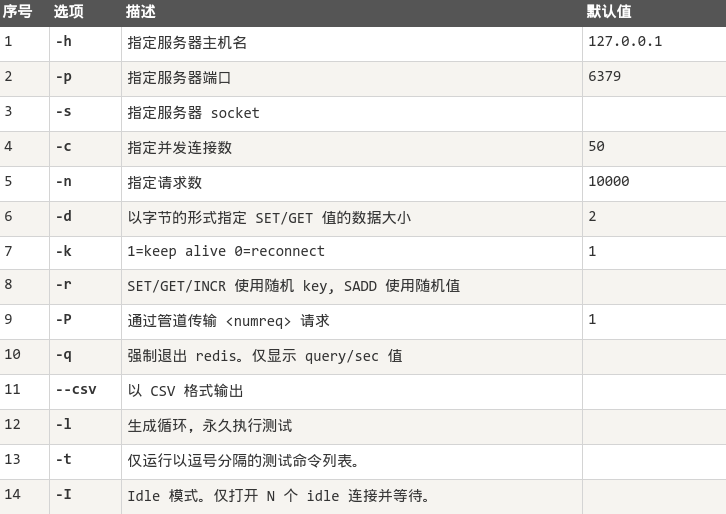

## 数据备份
创建当前数据库的备份, 会在安装目录创建`dump.rdb` 文件
从备份恢复时也会同样从安装目录里找这个文件

    > config get dir        # 查看安装目录
    > save
    > bgsave                # 恢复数据

## 安全
通过Redis配置文件可以设置连接密码, 以保证服务安全

    > config get requirepass            # 查看是否设置密码
    > config set requerepasss password  # 设置密码

设置密码之后, 从客户端连接至Redis服务就需要经过密码验证

    > auth password

## 性能测试
性能测试的基本命令如下

    redis-benchmark [option] [option value]

## 客户端连接
Redis 通过监听一个TCP端口或者Unix socket的方式来接收来自客户端的连接. 建立一个连接, Redis会做一下工作

- 首先, 客户端 socket 会被设置为非阻塞模式, 因为 Redis 在网络事件处理上采用的是非阻塞多路复用模型
- 然后为这个套接字设置TCP_NODELAY 属性, 禁用 Nagle 算法
- 然后创建一个可读的文件事件用于监听这个客户端 socket 的数据发送

## 管道技术
Redis 管道技术可以在服务端未响应时, 客户端可以继续向服务端发送请求, 并最终一次性读取所有服务端的响应

## 分区
分区是分割数据到多个Redis实例的处理过程, 因此每个实例只保存key的一个子集

分区的优势:

- 通过利用多台计算机内存的和值, 允许我们构造更大的数据库
- 通过多核和多台计算机, 允许我们扩展计算能力
- 通过多台计算机和网络适配器, 允许我们扩展网络带宽
