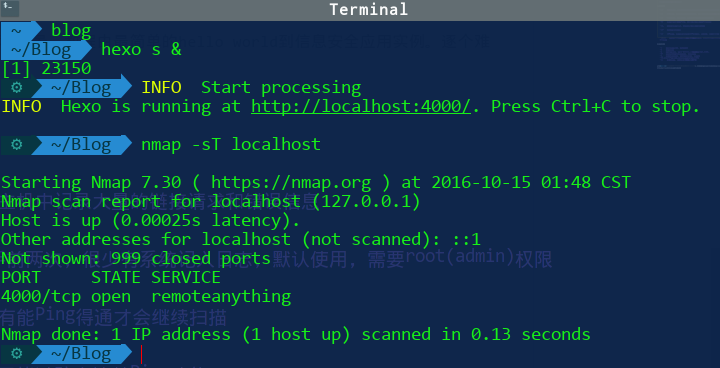

端口扫面实现方式有

- TCP 扫描, 简单但很容易被主机发现
- SYN 扫描, 只完成三次握手前两次, 不易被发现, 需要root权限
- Ping扫描, 不了解

最简单的端口扫描期就是基于socket套接字, 通过不同IP和端口的组合, 不断地尝试连接

```python
import socket

# 多主机扫描
hosts = []
ports = []

for host in hosts:
    for port in ports:
        try:
            print("[+] connecting to %s : %d" %(host, port))
            s.connect((host, port))
            s.send('Primal Security \n')
            banner = s.recv(1024)
            if banner:
                print "[+] Port "+str(port)+" open: "+banner
            s.close()
        except:
            pass

```

端口扫描利器: [Nmap](https://nmap.org/)

基本用法:

    nmap [扫描类型] [参数] 目标IP　　　

扫描类型

    -sT　　TCP 连接扫描，会在目标主机中记录大量的链接请求和错误信息

    -sS　　SYN扫描，只完成三次握手前两次，很少有系统记入日志，默认使用，需要root(admin)权限

    -sP　　Ping扫描，默认使用，只有能Ping得通才会继续扫描

    -P0　　扫描之前不需要Ping，用于绕过防火墙禁Ping功能

    -sA　　高级的扫描方式，用来穿过防火墙的规则集

    -sV　　探测端口号版本　

    -sU　　UDP扫描，扫描主机开启的UDP的服务，速度慢，结果不可靠　

    -sX -sN 　　秘密的FIN数据包扫描，圣诞树(Xmas Tree)和空模式，针对Unix和Linux主机，系统要求遵循TCP RFC文档

扫描参数

    -v　　显示扫描过程，推荐使用
    -h　　帮助文档
    -p　　指定端口号，如[1-65535],[22,135,1433,3306,]等格式
    -O　　启动远程操作系统监测，存在误报
    -A　　全面系统监测，使用脚本检测，扫描等
    -T4　 针对TCP端口禁止动态扫描延迟超过10ms
    -iL　　批量扫描，读取主机列表，如[-iL  C:\ip.txt]

本地开hexo server 做个小测试



还有[Massan](http://www.freebuf.com/sectool/112583.html), 号称是最快的互联网端口扫描器, 可以在六分钟内扫遍互联网
