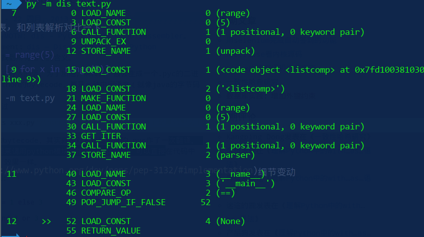

这个扩展感觉是源自参数列表 ***args**

    first, *rest = [1, 2, 3]
    # first = 1, rest = [2, 3]
    first, *middle, last = [1, 2, 3, 4]
    # first = 1, middle = [2, 3], last = 4

如标题所言, 可迭代对象都可以使用扩展解包

    a, *b, c = range(5)
    first, rest = seq[0], seq[1:]

解包赋值优先级比变量赋值要低

    a, *b, c = [1, 2]    # b = None

不过注意一点

    *whole = range(5)   # error
    *whole, = range(5)  # works

同样是构造列表, 和列表解析对比一下

    *unpack, = range(5)
    parser = [x for x in range(5)]

$ python dis -m text.py
可以发现生成的字节码比列表解析还要少!

[实现](https://www.python.org/dev/peps/pep-3132/#implementation)细节变动
