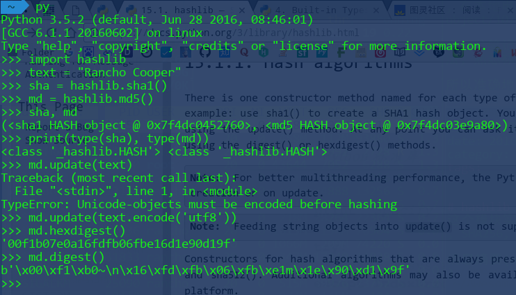

# hashlib -- 消息摘要与安全散列
这个模块实现了通用的加密算法, 包括FIPS(联邦信息处理标准)中的SHA1, SHA224, SHA256, SHA384, SHA512, 以及RSA中的MD5算法

消息摘要(message digest)是以前的叫法, 现在普遍用术语安全散列(secure hash)

*note: adler32, crc32函数在`zlib`模块*

## 哈希对象
每种类型的加密算法都有一个返回相应哈希对象的构造函数

哈希对象支持的方法:
- update(): 对明文进行加密, 支持增量加密, 只接受bytes参数
- digest(): 按二进制读取密文(摘要)
- hexdigest(): 按十六进制读取密文
- copy(): 创建哈希对象的复制体



## 按名创建
模块函数hashlib.new(name[, data])所支持的算法要取决于机器上OpenSSL库的支持情况. 相比之下, 通过哈希对象来创建是首选, 因为new()要慢一些


## 模块常量和其他属性

hashlib.algorithms_guaranteed 所有平台支持的哈希算法
hashlib.algorithms_available 当前解释器支持的哈希算法, 是前者的超集

hash.digest_size 所得密文(摘要的大小)
hash.block_size 加密算法的内部固定长度(分组加密设计如此)

hash.name 小写的可传给new()的规范哈希名

## 密钥生成


## 源码阅读

- memoryview() **sliced without copying the underlying data, unlike bytes/str!**
举个例子就知道了

```python
import time
for n in (100000, 200000, 300000, 400000):
    data = 'x'*n
    start = time.time()
    b = data
    while b:
        b = b[1:]
    print 'bytes', n, time.time()-start

for n in (100000, 200000, 300000, 400000):
    data = 'x'*n
    start = time.time()
    b = memoryview(data)
    while b:
        b = b[1:]
    print 'memoryview', n, time.time()-start

#### outputs:
bytes 100000 0.200068950653
bytes 200000 0.938908100128
bytes 300000 2.30898690224
bytes 400000 4.27718806267
memoryview 100000 0.0100269317627
memoryview 200000 0.0208270549774
memoryview 300000 0.0303030014038
memoryview 400000 0.0403470993042
```


## 相关资源
[memoryview](http://stackoverflow.com/questions/18655648/what-exactly-is-the-point-of-memoryview-in-python)
[HMAC-MD5](https://www.zhihu.com/question/19816240)
