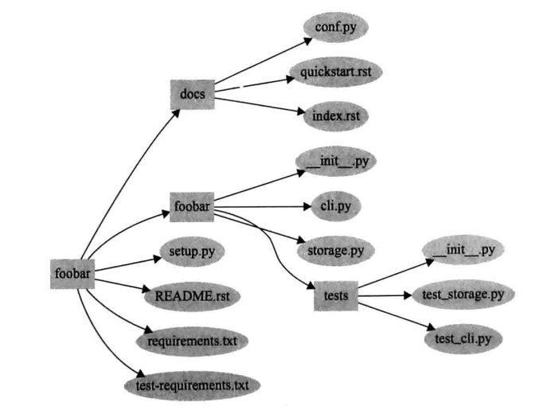

## 版本选择
作为Arch用户, 那能不拥抱新变化吗?

## 项目结构

太深的层次结构其目录导航就是梦魇, 太平的层次结构又会显得臃肿

标准包目录结构

注意几点
- 单元测试应该在一级子目录
- docs中应该包含reStructuredText文档, 以便Sphinx进行处理
- 额外的数据(图片, shell脚本等)没有统一标准

其他可选的顶级目录
- etc: 存放配置文件的样例
- tools: 存放与工具相关的shell脚本
- bin: 存放将被setup.py安装的二进制脚本
- data: 其他类型的文件

## 版本编号
PEP-440对版本格式做了详细说明, 用正则式表达就是

    N[.N] + [{a | b | c | rc}N][.postN][.devN]

- x.y 与x.y.0是一样的
- 与N[.N]相匹配的被认为是最终版本
- 基于日期的版本(比如2016.11.10)是无效的
- 字母含义:
    - alpha: 不稳定或缺少某些功能
    - beta: 功能已经完整, 但可能仍有bug
    - rcl: 候选版本

[语义版本](http://semver.org)与PEP-440并不完全兼容, 且Git中的哈希标识也不能和PEP-440中定义的模式兼容

## 编码检查
详情参阅[PEP-8](https://www.python.org/dev/peps/pep-0008/)

一些工具
- pep8
- pyflakes: 并不遵循PEP-8
- pylint: 支持PEP-8
- flack8: 结合了pyflakes和pep8的项目
- hacking: flack8的扩展

最好使用flake8与hacking结合使用来改进代码质量
