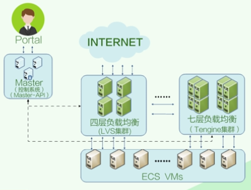

针对阿里SLB产品的分析

links:

面对海量请求的应用场景, 为了更好发挥服务器集群的性能, 在请求与应用服务之间, 需要做一定的流量引导, 这就是负载均衡

可以通过纯硬件或软件两种方式实现负载均衡

硬件的缺点:
- 硬件价格高, 而且在实际机房里, 如果该硬件出现故障, 会导致流量阻塞. 所以通常会外加两台设备来做备份

## SLB核心概念
三层模型:

- LoadBalancer, 前台实例
- Listener, 用户定制的负载均衡策略与转发规则
- BackendServer, 后端的一组云服务器

## SLB整体架构
整个SLB系统由3部分构成: 四层负载均衡, 七层负载均衡, 以及控制系统

这里的四层和七层的术语是源自ISO的七层网络标准(分别位传输层和应用层)

- 四层负载均衡: LVS
- 七层负载均衡: Tengine
- 控制系统: 配置和监控整个负载均衡系统

## 四层负载均衡
由前端负载均衡器和后端服务池组成, 一般一组服务池对应一组应用.

前端负载均衡器采用LVS+Keepalive架构, 用两台LVS机器互为备份(主从关系), 通过VRRP(虚拟路由冗余协议)自动切换来保证其工作的可靠性

## 七层负载均衡
主要针对HTTP等应用层服务提供负载均衡

对HTTP服务而言, 请求不仅通过LVS进行转发, 还要在LVS与WebServer之间增加转发服务. 这层转发服务会查看请求的HTTP头, 并根据规则配置(域名)转发到相应的后端Web服务器

## SLB产品特征

- 提供两种负载均衡(TCP, HTTP)
- 智能自检, 自动屏蔽异常的ECS, 恢复后自动接触屏蔽
- 会话保持, 七层负载均衡可以在会话的整个生命周期里做到点对点转发
- 多种规则, 加权轮询(WRR), 加权最小连接数(WLC)
- 可控制带宽峰值, 避免部分攻击和流量损失
- 支持公网和私网
