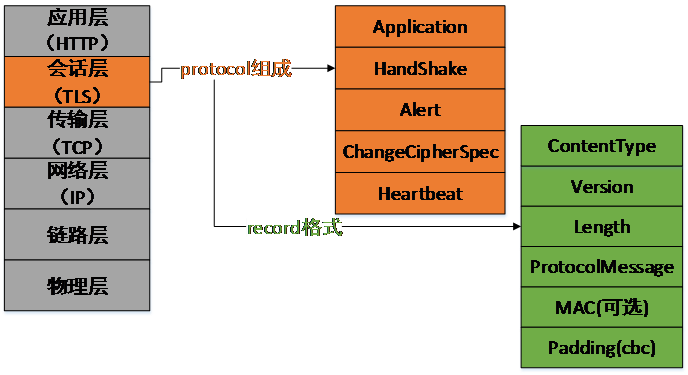
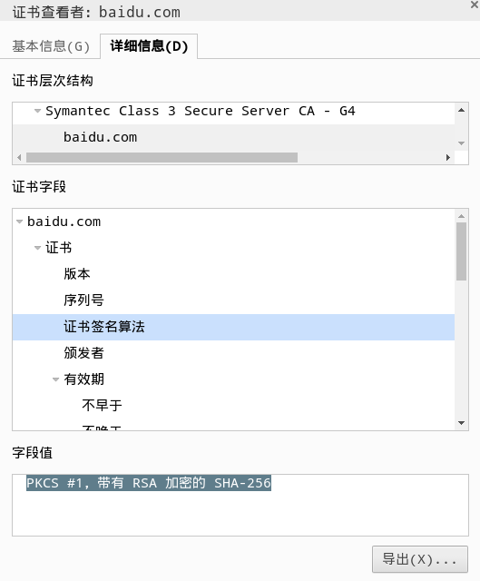
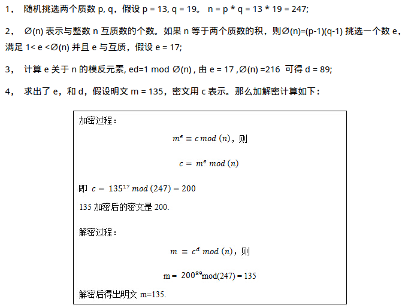
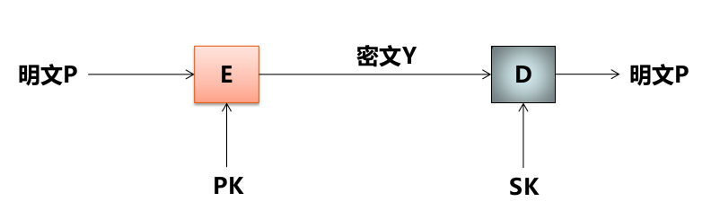
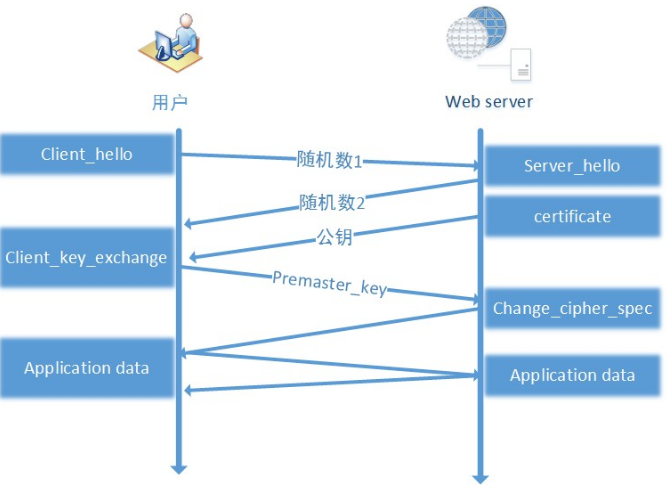
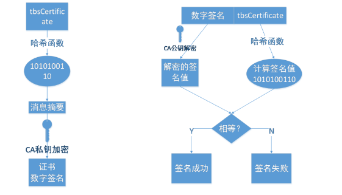

## HTTPS概述
HTTP是众所周知的Web传输协议, 但其有个致命缺陷在于其安全性.
而HTTPS就是HTTP + TLS(传输层安全协议, 其前身是安全套接层SSL), 也就是说, 在原来的协议栈里加入了一层安全协议

关于SSL/TLS的更多内容, 可以看阮一峰的[文章](www.ruanyifeng.com/blog/2014/02/ssl_tls.html)和[这里
](security.stackexchange.com/questions/20803/how-does-ssl-tls-work)

TLS在协议栈中的位置及协议组成如图:

TLS协议包含应用数据层协议, 握手协议
TLS协议包含应用数据层协议, 握手协议, 报警协议, 加密消息确认协议, 心跳协议五部分. 而TLS协议本身是靠
record协议传输的, record协议格式如图最右侧所示

TLS协议的各版本中, 1.1和1.2暂时没发现安全漏洞, 并且有大量扩展可以提升速度和性能

## HTTPS功能介绍
HTTP本身是明文传输, 所以报文所经过的中间网络节点(WIFI热点, 路由器, 防火墙, 反向代理和缓存服务器等)
完全可以随意嗅探报文内容, 以达到窃听, 篡改, 甚至冒充等目的

为对抗这些劫持行为, HTTPS提供了一下三方面功能
- 内容加密, 第三方无法窃听
- 校验机制, 一旦发生篡改行为通信双方会立马察觉
- 身份认证, 防止冒充

## HTTPS原理

### 内容加密
加密算法一般分为对称加密和非对称加密, 区分的标准在于加/解密所用的密钥是否相同

关于数据加密的基本概念可以看这篇[notes](https://github.com/RanchoCooper/AwesomeNotes/blob/master/网
络技术与应用/09网络安全.md)

通常来说对称加密保密性高, 一般无法破解. 但问题在于需要妥善保管密钥, 一旦密钥本身外泄, 就毫无安全性可
言了. 并且对于Web服务器而言, 同时保存大量密钥是不菲的负担, 因此网络中一般采取非对称加密算法

非对称加密所用的密钥是基于会话的, 不同会话所用密钥不用. 但在网络中使用它来加密唯一不足是会带来网络速
度的降低

#### 非对称密钥交换
非对称密钥交换的最大特点体现在其密钥生成和使用的安全性上, 常见的有以下密钥加密算法:

- RSA：算法实现简单, 诞生于 1977 年, 历史悠久, 经过了长时间的破解测试, 安全性高. 缺点就是需要比较大的素数（目前常用的是 2048 位）来保证安全强度, 很消耗 CPU 运算资源. RSA 是目前唯一一个既能用于密钥交换又能用于证书签名的算法.
- DH：diffie-hellman 密钥交换算法, 诞生时间比较早（1977 年）, 但是 1999 年才公开. 缺点是比较消耗 CPU 性能.
- ECDHE：使用椭圆曲线（ECC）的 DH 算法, 优点是能用较小的素数（256 位）实现 RSA 相同的安全等级. 缺点是算法实现复杂, 用于密钥交换的历史不长, 没有经过长时间的安全攻击测试.
- ECDH：不支持 PFS, 安全性低, 同时无法实现 false start.
- DHE：不支持 ECC. 非常消耗 CPU 资源.

其中推荐的是RSA和ECDH_RSA算法

1. ECDHE 支持 ECC 加速, 计算速度更快. 支持 PFS, 更加安全. 支持 false start, 用户访问速度更快.

2. 目前还有至少 20% 以上的客户端不支持 ECDHE, 我们推荐使用 RSA 而不是 DH 或者 DHE, 因为 DH 系列算法非常消耗 CPU（相当于要做两次 RSA 计算）

通常所说的 ECDHE 密钥交换默认都是指 ECDHE_RSA, 使用 ECDHE 生成 DH 算法所需的公私钥, 然后使用 RSA 算法进行签名最后再计算得出对称密钥

非对称加密算法本身也存在两个明显缺点：

1. CPU资源消耗巨大: 一次完全 TLS 握手, 密钥交换时的非对称解密计算量占整个握手过程的 90% 以上. 而对称加密的计算量只相当于非对称加密的 0.1%, 如果应用层数据也使用非对称加解密, 性能开销太大, 无法承受.

2. 加密内容的长度限制: 不能超过公钥长度. 比如现在常用的公钥长度是 2048 位, 意味着待加密内容不能超过 256 个字节.

#### RSA算法介绍

RSA是HTTPS体系中最为重要的算法, 算法设计本身涉及了很多数论定理

算法过程:

其中, (n, e)就是公钥对, (n, d)就是私钥对. 而这里的n和d都是接近2 ^ 2048的大数. 由于CPU密集而导致性能
不足的就是解密m的那一步

一般会把公钥对(n, e)注册到证书里, 这里的e取值比较小, 一方面减少了客户端的计算量, 另一方面会使私钥对
中的d变大, 使得其破解难度提高

#### 握手过程中的密钥协商
不对称加密算法的基本过程如下

以TLS1.2为例, 一次HTTPS会话中的密钥生成及使用过程如下

1. 浏览器发送client_hello, 其中包含随机数random1
2. 服务器回复server_hello, 其中包含随机数random2, 同时回复携带证书公钥P的certificate
3. 浏览器收到random2之后生成premaster_secret以及master_secrect. 前者长度为48字节, 包含了协议版本号和一个用于填充的随机数. 结构如:

    struct { byte version[2];  byte random[46] };

而master_secrect生成算法简述如下:

    master_key = PRF(premaster_key, label, random1+random2)
    PRF是一个随机函数, 定义如:
        PRF(secret, label, seed) = P_MD5(s1, label+seed) XOR P_SHA-1(s2, label+seed)

所以master_key得到的这个随机数是基于浏览器/服务器双方给出的random1herandom2(seed = random1 + random2)

完成这三步, 浏览器的密钥协商就已经完成了

4. 浏览器使用证书公钥将premaster_secrect加密发送给服务器
5. 服务器使用私钥解密得到premaster_secrect, 再结合之前接收到的random1, 用相同算法求出相同的master
   secrect

可以看出, 密钥协商过程需要两个RTT. (所以HTTPS慢于HTTP)
RSA所做的, 就是对premaster_secrect进行加/解密

### 身份认证
身份认证主要涉及PKI和数字证书, PKI(公钥基础设施)通常包含:

- end entity: 终端实体, 一个终端硬件或是网站
- CA: 证书签发机构
- RA: 证书注册及审核机构
- CRL issuer: 负责证书撤销列表的发布和维护
- Repository: 负责数字证书及 CRL 内容存储和分发

数字证书有两个作用:

1. 身份授权: 确保浏览器访问的网站是经过CA验证的可信任的网站。
2. 分发公钥: 每个数字证书都包含了注册者生成的公钥. 比如前文提到的 RSA 证书公钥加密是使用的这个公钥

### 数据完整性
类似平时的 md5 签名, 只不过安全要求要高很多. openssl 现在使用的完整性校验算法有两种:MD5 或者 SHA. 由于 MD5 在实际应用中存在冲突的可能性比较大, 所以尽量别采用 MD5 来验证内容一致性. SHA 也不能使用 SHA0 和 SHA1, 中国山东大学的王小云教授在 2005 年就宣布破解了 SHA-1 完整版算法
