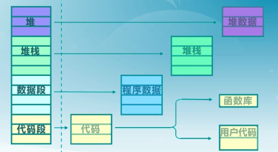
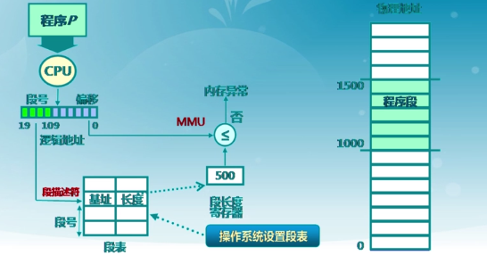
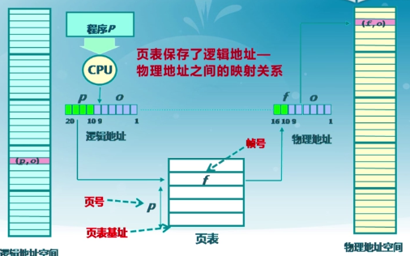
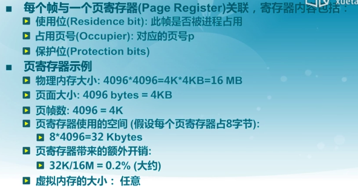

## 需求背景
连续分配的缺点
- 分配给程序的内存必须连续
- 外碎片和内碎片不可避免
- 内存分配的动态修改较难
- 内存利用率低

非连续分配的目标: 提高内存利用效率和管理灵活性
- 允许一个程序使用非连续的物理地址空间
- 允许共享代码与数据
- 支持动态加载和动态链接

需要解决的问题
- 实现虚拟/物理地址的转换
    - 软件实现(灵活, 开销大)
    - 硬件实现(够用, 开销小)
- 如何确定合适的块大小

## 段式存储管理
在段式存储中, 我们视程序地址空间由多个段构成, 比如主代码段, 子模块代码段, 公用库代码段, 堆栈段, 数据段, 初始化数据段, 符号表等. 段式存储管理的目的在于更细粒度和灵活化的分离与共享

各部分内部是连续存储的, 通过段基址+偏移的方式来访问. 而各部分之间通常不会跨段访问. 所以所谓的段式存储, 就是先对运行程序所需的空间作一次类别上的划分(同一属性的数据存在同一个段中), 而在访问数据时, 通过二元组(segment, offset)来描述其逻辑地址

在实际过程中, CPU计算出数据所在的逻辑地址, 然后去查找段描述符(进程描述符的子结构, 由相应操作系统维护), 并检查其偏移是否越界

## 页式存储管理
和段式存储管理的出发点不同, 页式存储把物理地址空间按照固定大小(通常为2的幂, 如512, 1024, 2048)来进行划分, 这样基本的分配单元就叫页帧, 物理页面(frame). 同样把逻辑地址空间也作相应的划分, 并称为页面, 逻辑页面(page)

### 页帧 Frame
表示: 二元组(f, o), 页帧序号和帧内偏移
如果物理内存被分为2^F个帧, 且每帧有2^S字节, 则
物理地址 = f * 2^S + o

假设地址空间为16位, 采用页帧大小为512字节, 那么页式管理中, S = log512 = 9位, 所以帧内偏移占用后面的9位, 而前面的9位则留给页号使用. 对于逻辑地址(3, 6), 其物理地址 = 3*512+6 = 1542

### 页面 Page
进程的逻辑地址表示中, 页内偏移和帧内偏移是一致的, 而页号大小不一定和帧大小一致
类似的, 其表示为(p, o)

而页帧和页面的映射关系, 需要维护页表(配合MMU/TLB)

- 页面到页帧的映射, 逻辑地址中的页号是连续的, 物理地址中的帧号是不连续的
- **不是所有的页都有相对应的物理帧**

### 页表概述
页表结构:
每个进程都有一个页表
- 每个页面对应一个页表项
- 它随实际运行而不断变化
- 存储在页表基址寄存器(PTBR)

实际维护的表项内容, 其实不单只有地址信息, 还会有用于记录修改, 访问, 引用等信息

### 页式存储管理的性能问题

- 内存访问的问题: 每访问一个内存单元要先获取页表项再访问数据(2次内存访问)
- 页表大小的问题: 如果物理内存很大, 而采用的页帧很小, 就会导致页表很大(64位地址总线如果采用4K页帧, 页数就达到了2^50)

所以我们相应地提出了缓存和间接访问(切割页表, 查询子表)

### 快表和多级页表

- 缓存最近访问过的页表项
    - TLB使用关联存储实现, 访问速度很快(不需要访问内存)
    - 缓存机制和Cache类似
    - 不过缓存的内容有限
- 构建页表"树"(应该是在地址总线比较大的情况下会采用)

## 反置页表
前面讨论的页表都是在页表和逻辑地址之间作映射, 这样随之而来的一个问题就是在64位地址总线下, 管理逻辑地址和页表就变得繁琐. 所以反置页表的想法就是对页表和物理地址作映射, 这样, 不管进程多少, 页表级数多少

反置页表的实现要配合页寄存器

## 段页式存储管理
段式存储的特点在于内存的保护, 而页式存储的特点在其利用率以及外设存储
