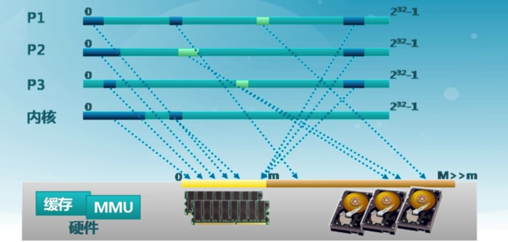
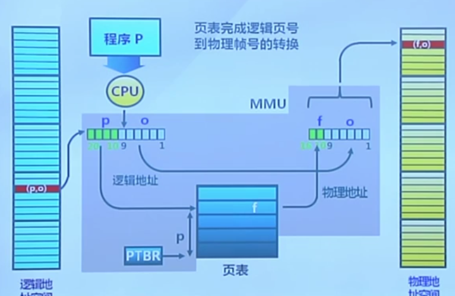
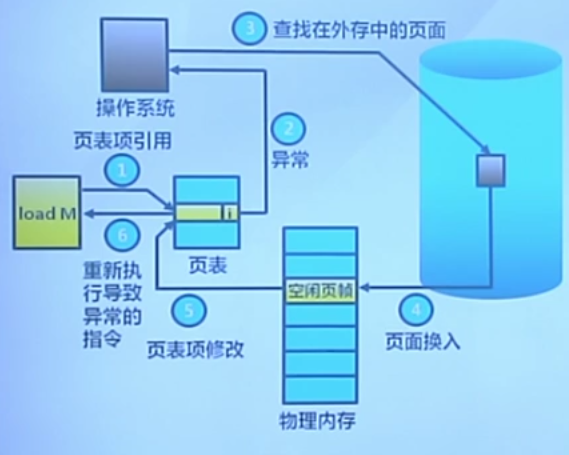

## 需求背景

我们理想的存储器最好是同时满足这些要求
- 容量更大
- 速度更快
- 价格更便宜
- 非易失性存储器

但可惜的是这些特性往往相互制约, 所以物理层的存储器力量有限, 就需要配合精明的逻辑层来管理存储

我们期望的存储操作因为应该是统一的, 不受物理单元种类的影响, 而这部分工作就完全靠操作系统来完成

虚拟存储一方面做到了存储抽象的一致性, 另一方面解决了内存空间不足的问题
- 覆盖(overload): 应用程序手动把需要的指令和数据保存在内存里
- 交换(swpping): 操作系统自动把暂时不能执行的程序保存到外存里
- 虚拟存储: 在有限容量的内存中, 以页位单位, 获得更大容量

## 覆盖和交换
覆盖技术的目标是期望能够在较小的可用内存中运行较大的程度, 其做法是先按照程序的逻辑结构, 把程序划分位若干功能相对独立的模块, 然后让不会同时执行的模块共享同一块物理内存(需要时就覆盖掉这一部分内存区域)
- 必要部分: 常用功能的代码和数据常驻内存
- 可选部分: 不常用的模块, 仅在需要时载入内存

感觉可以把划分后的模块组织成二叉树, 每一层的节点共享同一块内存(其大小取决于这一层里模块所需的最大空间), 不过还应该考虑到模块大小, 使得每一层的节点大小相近

不足之处:
- 增加编程难度: 如何划分模块, 如何确定覆盖关系
- 增加执行时间: 典型的时间换空间

交换技术的目标是期望能够增加正在运行或需要运行的程序的内存. 其思想就是"外存内存化", 把部分程序暂时地移入外存里(整个进程的地址空间)
- 换出
- 换入

交换的实现:
- 交换时机: 内存空间可能不够或已经不够时换出
- 交换区的大小: 存放所有用户进程的所有内存映像的拷贝
- 换入的重定位问题: 采用动态地址映射

两者对比:
- 覆盖:
    - 需要程序员给出逻辑覆盖结构
    - 只发生在没有调用关系的模块之间
    - 发生在进程的内部模块间
- 交换:
    - 操作单位是进程
    - 不需要过多的逻辑结构, 简单
    - 发生在进程之间

覆盖技术是面向单个较大程序的内存节省, 交换技术是期望尽可能地做到多进程并行.

## 局部性原理
局部性原理体现在程序从载入到执行的生命周期中
- 时间局部性: 同一条指令或数据可能短期内会再次被访问
- 空间局部性: 当前指令或数据与邻近指令或数据往往集中在一块区域中
- 分支局部性: 相邻两次跳转指令可能跳转到相同的内存地址(循环)

程序运行所需指令和数据的集中性

局部性特征的更多讨论可以参考深入理解计算机系统ch02

## 虚拟存储概念
虚拟存储技术的目标是将不常用的内存块暂存到外存中去
- 内存仅存放部分进程, 从而管理比物理内存更大的内存空间
- 实现交换技术, 从而获得更多的空闲内存空间

实现:
- 装载程序时, 只装入当前指令执行所需的页面和段
- 发生缺页或缺段时按需载入相应页面或段
- 操作系统监控页面和段的使用情况(置换算法)

## 虚拟页式存储
其实就是在之前的 页式存储管理的基础上再增加请求调页和页面置换

看起仅仅是多了缺页异常

也表结构:
- 驻留位: 表示该页是否在内存中
- 修改位: 表示该页是否被修改(换出时内容回写)
- 访问位: 页面置换的依据
- 保护位: 该页的访问方式

## 缺页异常

性能评价
有效存储访问时间EAT(effective memory access time) = 访存时间 * (1-p) + 缺页异常处理时间 * 缺页率p
