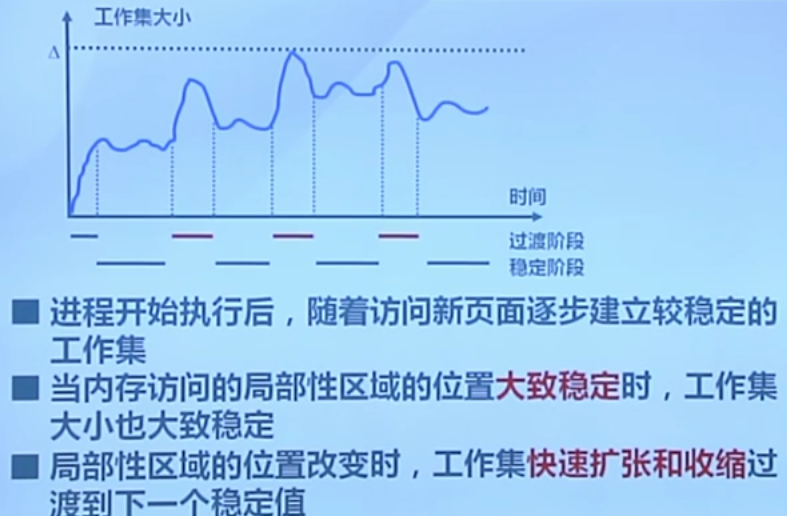
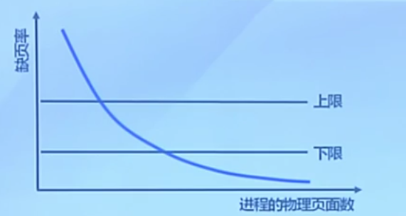

## 置换算法的概念
功能: 当出现缺页异常的时候, 需要调入新页面而物理内存已满, 这时就要选择被置换的物理页面

目标: 尽力减少页面调入调出的次数, 做出的置换决策尽可能明智(替换不再访问或近期不再访问的页面)

页面锁定: 一部分必须常驻内存的不参与置换的页面, 通常是操作系统的关键部分以及要求响应速度的代码和数据, 通过页表项中的锁定标志位实现

性能评估: 在一定的页面请求中做缺页次数的统计

算法分类:
- 局部页面置换算法
    - 置换页面的选择范围仅限于当前进程所占用的物理页面
    - 包括: 最优算法, 先进先出, 最近最久未使用
    - 最近最久的近似: 时钟算法, 最不常用
- 全局页面置换算法
    - 置换页面的选择范围是所有可换出的物理页面
    - 包括: 工作集算法, 缺页率算法

## 局部页面置换算法

### 最优页面置换算法(OPT)
思路: 每次置换在未来最长时间不访问的页面
实现: 发生缺页, 计算内存中每个逻辑页的下次访问时间
特征:
- 缺页最少, 最理想的算法
- 实际中无法实现, 无法预知下次访问时间
- 可作为其他算法性能的评价标准

### 先进先出算法(FIFO)
思路: 每次置换在内存中驻留时间最长的页面
实现: 维护一个逻辑页面链表, 载入页面时从链尾加入页面, 缺页时选择链首页面进行置换
特征:
- 实现简单
- 性能较差, 没有考虑到页面本身再次被访问的概率
- 进程所分配的物理页面增加时, 缺页反升不减(Belady现象)

### 最近最久未使用算法(Least Recently Used, LRU)
思路: 根据过去的使用情况来预测未来, 每次置换最长时间没被引用的页面
实现: 发生缺页时计算内存中每个逻辑页面的上次访问时间
特征: 最优算法的一种近似, 不过开销较大(统计过于细致)

页面链表:
链首是最近才使用过的页面, 链尾是最久未使用的页面. 发生页面请求时, 将相应页面移到链首, 发生缺页则从链尾置换

活动页面栈:
访问页面时将页号入栈, 并抽出栈中相同的页号. 缺页时置换栈底的页面

### 时钟页面置换算法
思路: 改良版的LRU, 仅对页面的访问情况做大致统计
实现: 访问页面时, 在页表项里记录页面访问情况, 缺页时, 从指针处开始顺序查找未被访问的页面并置换
数据结构的变动:
- 页表项里增加访问位, 描述页面在过去一段时间内是否被访问过,
- 各页面组织成环形链表
- 指针指向最先调入的页面

特征: 柔和了FIFO和LRU的特点

算法过程:
- 页面装入内存时, 访问位初始化为0
- 访问页面(读/写)时, 访问位置值
- 缺页时, 指针从当前位置顺序检查
    - 若页面访问位为0, 则置换该页
    - 若页面访问位为1, 重置访问位并移至下一页面

### 改进的时钟算法
思路: 减少修改页的缺页处理开销(如果被置换同时被修改过, 其处理时间会加倍)
实现: 在访问位的基础上再增加修改位, 发生缺页时跳过那些被修改过的页面

### 最不常用算法(Least Frequently Used, LFU)
思路: 发生缺页时置换访问次数最少的页面
实现: 为每个页面提供访问计数, 定期将计数右移

LRU关注页面访问间隔, 间隔越短则认为页面重要(需要借助栈等数据结构)
LFU关注页面访问次数, 次数越多则认为页面重要(简单计数, 为防止计数过大另作一定的衰减处理)

另外对于较多的外设存取操作的场景, 访问间隔的描述精度会降低, 这时候访问次数更为可靠

### Belady现象
出现随着分配给进程的物理页面数增加, 缺页数随之增加的异常现象(FIFO)
原因: 置换算法侧重的特征与进程实际访问内存的动态特征间的矛盾

LRU不存在Belady现象

### 几种局部算法的比较
LRU与FIFO都是基于先进先出的思路:
- LRU依据页面最近访问时间来排序
- FIFO依据页面进入内存的时间来排序
而LRU在每次页面请求时都要动态地调整顺序, 故其开销要更大
退化情况: 如果页面进入内存不会再次被使用, 这时LRU就退化成了FIFO, 这时的缓存处理其实都是多余的(比如播放视频)

LRU算法性能好, 但系统开销较大, FIFO算法开销小, 但会有Belady现象, Clock对两者做了折中

对于未被访问过的页面, 三者的性能是一样的
对于访问过的页面, Clock仅仅描述了是否访问过, 而LRU详细记录了访问的次数.
Clock就是LRU的简化算法, 应该根据实际应用场景做选择(很少重读读取和频繁重读页面)

## 全局页面置换算法
全局页面置换算法需要考虑到进程本身分配的页面数(不同进程对内存需求量的差异)

思路: 为进程分配可变数目的物理页面
问题:
- 进程在不同阶段的内存需求是变化的
-

工作集: 一个进程当前正在使用的逻辑页面的集合, 可表示位二元函数W(t, Δ)
- t: 当前的执行时刻
- Δ: 工作窗口集, 一个定长的页面访问时间窗口
W(t, Δ)则是指在当前时刻t前的Δ时间窗口中所有访问页面所组成的集合, |W(t, Δ)| 则是工作集的大小, 就是进程所使用的页面数目的近似

常驻集: 当前时刻, 进程实际驻留在内存中的页面集合

工作集是进程运行过程中的固有性质(取决于程序的逻辑结构)
常驻集取决于系统分配给进程的物理页面和系统所采用的页面置换算法

- 工作集∈常驻集, 缺页较少
- 工作集变动剧烈, 缺页较多
- 常驻集达到一定数目, 缺页率不会明显下降

### 工作集置换算法
思路: 换出不在工作集中的页面
实现:
- 访存链表: 维护窗口内的访存页面链表
- 访存时, 换出不再工作集的页面
- 缺页时, 换入页面, 更新访存链表

保持工作集的精简, 缺页的处理变得简单

### 缺页率置换算法
缺页率: 缺页次数/内存访问次数  或  缺页平均时间间隔的倒数

影响因素:
- 所采用的页面置换算法
- 进程实际分配到的物理页面数量
- 页面大小
- 程序本身的设计

通过调节常驻集的大小, 来使进程缺页率保持在可接受的范围内

- 若进程缺页率过高, 增加常驻集
- 若进程缺页率过低, 减少常驻集(否则CPU利用率会降低)

实现: 访存时设置引用位标志, 缺页时, 计算上次缺页时间t_last和当前时间t_current, 并根据缺页率上下限设置一个常量T

- 若t_current - t_last > T, 说明缺页率过低, 置换在这段时间内未被引用的页
- 若t_current - t_last < T, 说明缺页率过高, 则载入缺失页到常驻集

前面的工作集算法在每次访存时都要更新工作集, 而缺页率算法仅在发生缺页时作相应的处理, 减少了开销
它和局部算法保持了一致

## 抖动和负载控制
抖动: 进程过多导致进程分配到的物理页面太少, 不能满足工作集的基本需求造成大量缺页, 频繁发生页面置换

MTBF: 平均缺页间隔时间
PFST: 缺页异常处理时间所以, 对实际运行的系统, 其并发数CPU利用率最高和缺页上限之前
