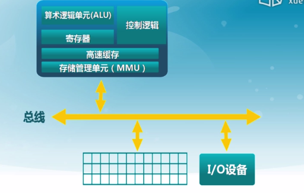
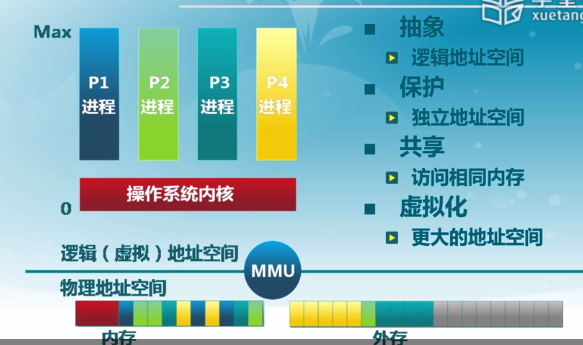
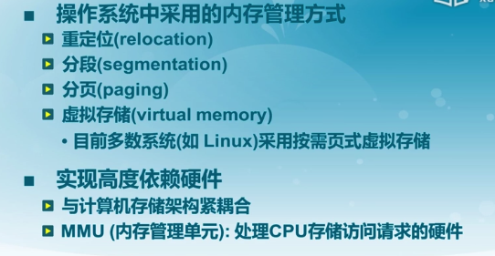
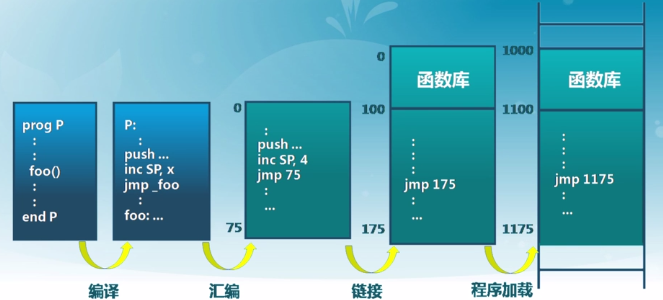
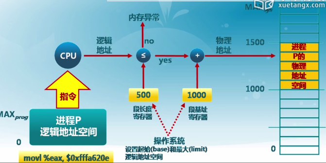

## 0x01存储结构和内存层次
计算机工作的本质其实就是处理存储在存储介质中的数据. 所以如何管理数据, 如何存取数据是其中重要的一个环节. 存放数据的地方, 包括CPU里的寄存器(高速缓存), 内存和外存.

寄存器容量很小, 通常只有32位或者64位, 所以它只面向的数据是不超过几百字节的尺度(不了解硬件架构, 一个CPU很小提供的寄存器不到一百吧)
对于32位总线的计算机, 它一次读写的数据为32位, 所以就有了4K对齐的说法, 这样读写速度会快一点. (如果没对齐的话原本只需读一次现在可能就得分两次读)
CPU中的高速缓存(Cache)存放了部分历史数据和执行指令, 所以一定程度上避免了重复读取相同内容的几率, 而且其速度很快(几个纳秒, 几乎和CPU频率一致). 不过写程序的时候是感觉不到高速缓存的存在的, 因为这部分完全由硬件控制, 但是可以通过优化代码来提高缓存的命中率(CSAPP里就有详细讨论)

在CPU之外的内存和外设的存储, 都是由操作系统来负责管理的. 内核本身占据一定的内存块, 然后每个进程有自己的内存空间和调用堆栈.

但要知道, 一台实际运行中的机器它的内存分部每时每刻都在变化, 甚至有时候一个正在运行的程序, 一部分已经读到内存里, 而另一部分还在外设(硬盘)上. 这就需要存储管理器将线性的物理地址转变成抽象的逻辑地址空间. 这样一来就需要对地址空间进行保护, 避免不同进程读取了不属于自己的东西. 同时还要做到共享, 比如你开了两个QQ, 相同的代码只读取一份存到内存里, 而不同账号的用户信息则独立存放. 所以地址空间既要独立, 也要共享, 两者要统一(更好的虚拟化)

综上, 操作系统提供的内存管理机制应该能够同时满足抽象, 保护, 共享和虚拟化.
要同时达成这些目标, 便采用了以下机制

- 重定位: 每次访问一个地址的时候通过段基址 + 偏移量来确定
- 分段分页机制: 进程的逻辑结构不必是连成一片的内存块, 程序的数据段, 代码段, 堆栈相对独立

## 0x02地址空间和地址生成
讨论地址的时候要有两个概念, 物理地址和虚拟地址. 前者是程序运行时得到的确切寻址位置, 而后者是进程可见的, 并可以通过它来确定一个物理地址.

当你写代码的时候完全不需要操心定义在其中的类, 函数, 变量最终在加载到内存上的样子, 虚拟地址的确定以及转换成物理地址交由编译器(C/C++等编译型语言)或解释器(Python, Lisp等解释型语言)来完成. 具体细节可以参考编译原理的内容

在上面的过程里有三种类别的地址

- 编译时确定的: 如果起始地址发生改变, 需要重新编译. 比如老式的功能手机, 出厂之后所有的东西都是写死了的
- 加载时确定的: 就是前面提到的重定位, 通常在可执行文件的开头部分有一段重定位表, 加载时根据里面的信息得到实际的绝对地址
- 执行时生成的: 可以简单理解为相对地址, 它最为灵活(需要硬件支持地址转换)

这几种做法在不同场合会有相应的应用

### 地址生成过程
举个实例, 比如当前CPU在执行一条指令

    movl %eax, $0xfffa620e    # 把寄存器里的内容存到相应地址中去

首先要通过硬件上的MMU来把指令中的地址转换成对应的物理地址, 然后通过控制器把总线控制信号(带有读/写标识)送到总线上去, 然后总线上就会有一段持续的读/写交互

所以在这里关键的是MMU完成的翻译工作, 而它做地址映射的依据, 则是操作系统维护的页表

![地址生成过程.png]

### 地址检查

在每一条指令执行会前去检查段长度以及偏移是否合法

## 0x03连续内存分配
内存分配是个重要的话题, 不管在操作系统还是在编程语言层面

对于内存分配, 要考虑到匹配性和利用率, 以及复杂度. 随着进程不断地创建和销毁, 内存碎片的问题是难以避免的.

- 外部碎片: 两个基本分配单元之间虽然空闲但无法分配的空间
- 内部碎片: 基本分配单元通常是2的幂, 其内部会有未被程序利用的空闲空间

而操作系统就要维护相应数据结构来描述已分配内存块和空闲块

### 几种分配策略

- 最先匹配
    - 原理: 空闲块列表按物理地址顺序排列, 分配时返回第一个满足的块
    - 优点: 简单, 而且空闲块集中在高地址部分
    - 缺点: 外部碎片, 请求块越大响应越慢

简言之, 实用主义, 对请求的响应快但后续的管理(碎片整理及回收)代价高

- 最佳匹配
- 原理: 空闲列表按块大小排列, 分配时返回当前最适合的块
- 优点: 减少外部碎片, 避免大空闲块被拆分
- 缺点: 响应比前者慢, 释放过程复杂, 容易产生无用小碎片

简言之, 完美主义

目前接触过来的算法里, 个人感觉可以算得上是最佳实践的方式, 就是Buddy Allocator

原视频里的实现是基于二维数组的, 云风实现过一个基于二叉树的伙伴分配器, 后来有人做了改进, 堪称教科书实现. 算法实现详情[见此](http://rancho1110.com/2016/10/01/%E4%BC%99%E4%BC%B4%E5%88%86%E9%85%8D%E5%99%A8%E7%9A%84%E6%9E%81%E7%AE%80%E5%AE%9E%E7%8E%B0/
)
