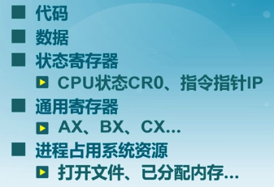
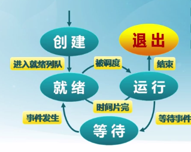
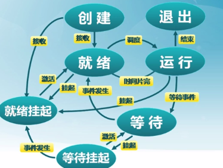
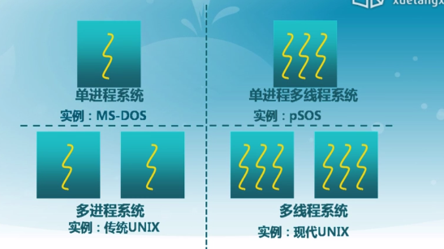
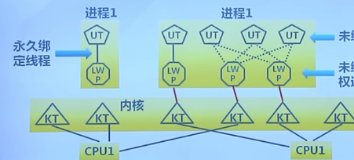
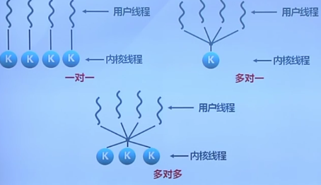

操作系统中重要的概念之一
其实就是对管理做了一层抽象

## 进程的概念
进程是一个具有一定**独立功能**的程序在一个**数据集合**上的一次**动态执行**的过程

### 进程的组成

### 进程的特点
- 动态性: 可以动态地创建, 销毁进程
- 并发性: 进程可以被独立调度(交替执行或发挥多核处理器性能)
- 独立性: 进程相互之间不受影响
- 制约性: 如访问了共享资源或进程间同步

## 进程控制块(PCB)
定义: 操作系统管理和控制进程运行所需的信息集合
包括: 进程标识信息(PID, UID), 现场恢复信息(调用堆栈, 寄存器), 进程控制信息(调度状态, 时间片, 进程所
用资源)

## 进程状态

一图以蔽之

上图中的状态转换是围绕CPU工作的, 实际上还有一种状态 -- 挂起
进程映像在磁盘上, 用以减少进程所占内存

其中PSOS通常应用在路由器里

## 线程实现
线程的实现分用户线程和内核线程两种

### 用户线程
- 不依赖操作系统内核
    - 内核无法识别, 以致当用户线程阻塞时, 内核会阻塞整个用户进程
    - 另外, 用户线程数增加, 而进程获得的时间片不变
    - 用户线程是一种逻辑实现, 可以弥补不支持线程的多进程操作系统
- 具体线程在用户空间实现
    - 每个进程拥有各自的线程控制块TCB
    - TCB由线程库函数维护
    - 进程可以自定义线程调度算法
- 线程创建, 销毁, 切换速度快, 没有用户/内核态转换
- 不支持基于线程的抢占

### 内核线程
- 由内核维护PCB和TCB
- 线程执行系统调用不会阻塞其他进程
- 线程的创建, 终止和切换开销较大
- 时间片分配以线程位单位, 所以多内核线程的进程会获得更多的CPU时间

### Solaris实现的轻权进程
内核支持用户线程的一种机制: 每个进程可以有若干轻量级进程, 每个轻权进程由一个内核线程来支持. 理论上结
合了用户/内核线程的特点, 但是实际应用并不理想

现在流行的操作系统实现, 仍是以一对一的实现为主

