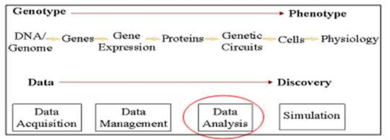
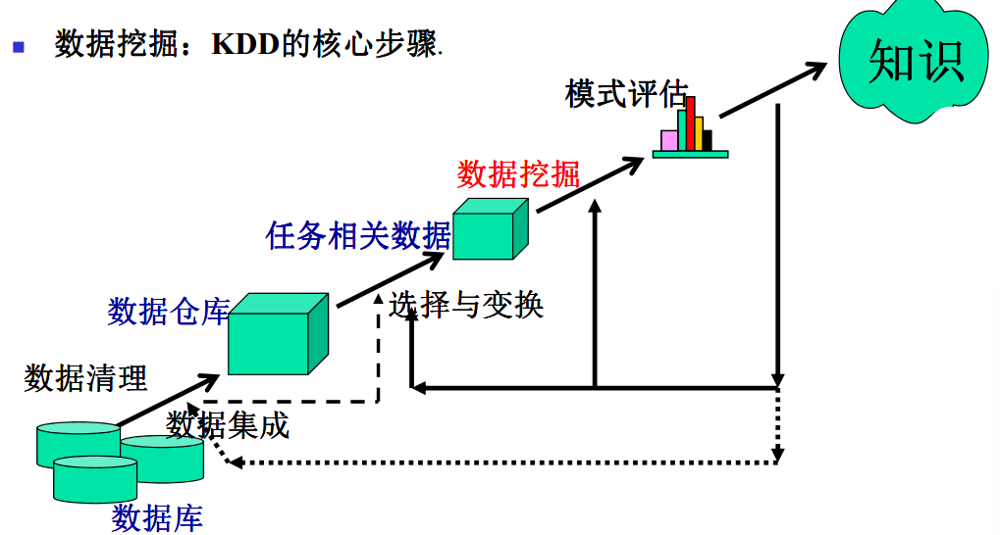
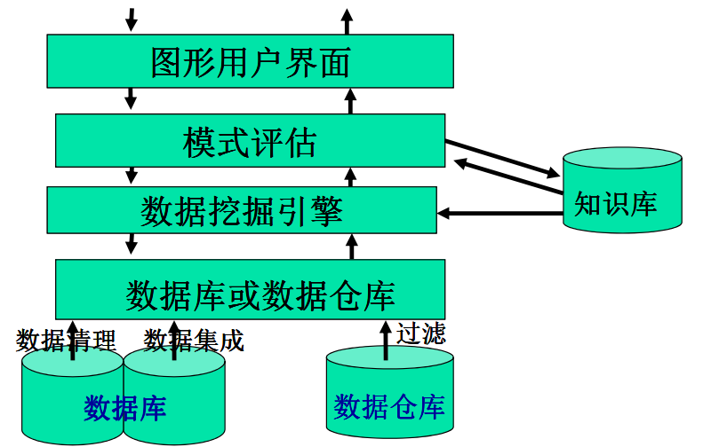
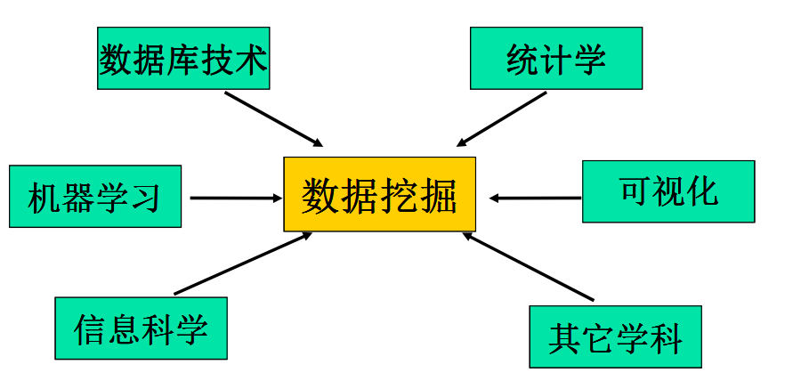
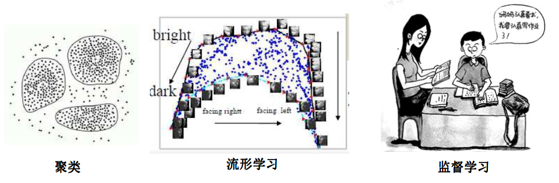
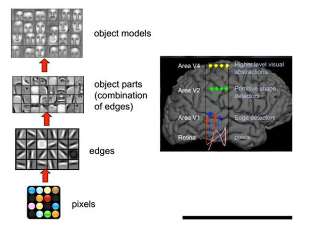
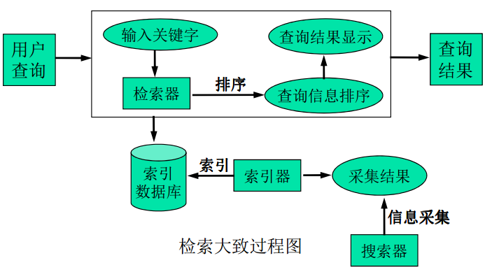

数据挖掘定义、知识发现与数据挖掘的关系、数据挖掘的功能、数据挖掘涉及的常用技术

## 什么是数据挖掘
数据挖掘 (数据库中知识发现):从大型数据库中提取有趣的（重要的，隐含的，目前未知的，潜在有用的）
信息和模式, 通常与计算机科学有关，并通过统计、在线分析处理、情报检索、机器学
习、专家系统和模式识别等诸多方法来实现上诉目标
其它叫法:
- 数据库中知识发现(挖掘) (Knowledge discovery in databases, KDD)
- 知识提取(knowledge extraction)
- 数据/模式分析(data/pattern analysis)
- 数据考古(dataarcheology)
- 数据捕捞(data dredging)
- 信息收获(information harvesting)
- 商务智能(business intelligence)

## 为何挖掘(潜在应用)
- 数据库分析和决策支持
    - 市场分析和管理 :目标市场, 顾客关系管理, 购物篮分析, 交叉销售(cross selling), 市场分割(market segmentation)
    - 风险分析与管理: 预测, 顾客关系, 改进保险, 质量控制, 竞争能力分析
    - 欺骗检测与管理
- 其它应用
    - 文本挖掘 (新闻组, 电子邮件, 文档资料)和Web分析
    - 流数据挖掘(Stream data mining)
    - DNA 数据分析
    - 智能询问回答

> 不难发现, 数据挖掘的意义在于从大量可测量数据中做出找出一些规律以帮助人们做出预测和决策

### 市场分析与管理
- 数据来源: 信用卡交易, 会员卡, 折扣券, 顾客投诉电话, 公众生活方式调查
- 目标市场: 找出具有相同特征（兴趣，收入水平，消费习惯等等）的模式“顾客群”
- 确定顾客随时间变化的购买模式: 从单独银行账户向联合银行账户的转变，例如：结婚
- 交叉销售分析(Cross-market analysis): 
    - 不同产品之间的销售关联/相关
    - 基于关联信息的预测

> 经典案例, "啤酒+尿布": 一般看来，啤酒和尿布是顾客群完全不同的商品，但是沃尔玛一年内数据挖掘的结果显示，男性顾客在购买婴儿尿片时，常常会顺便搭配几瓶啤酒来犒劳自己，于是沃尔玛就推出了将啤酒和尿布捆绑销售的促销手段以满足顾客需求

### 公司分析和风险管理
- 财经计划和资产评估
    - 现金流分析和预测
    - 财产分析的偶发性需求分析
    - 典型性分析和时序分析 (财政比率, 趋势分析等等)
- 资源计划 :
    - 总结和比较资源与开销
- 竞争:
    - 控制对手和市场的方向
    - 把顾客划分成许多类，再依据类的划分编制价格程序
    - 把这个价格策略放到高度竞争的市场环境内

### 生物信息科学
主要应用于蛋白质结构检测、微阵列数据分析、 DNA数据分析等。

### 其他应用
- 运动: IBM Advanced Scout分析NBA的统计数据 ( 阻挡投篮, 助攻, 和犯规 ), 获得了对纽约小牛队(New York Knicks)和迈艾米热队( Miami Heat )的竞争优势
- 天文: 借助于数据挖掘的帮助,JPL 和 Palomar Observatory 发现了22 颗类星体(quasars)
- Internet Web Surf-Aid: IBM Surf-Aid 将数据挖掘算法用于有关交易的页面的Web访问日志,以发现顾客喜爱的页面、分析Web 销售的效果、改进Web 站点的组织等

## 数据挖掘: 发现知识的过程
KDD的核心步骤

典型的数据挖掘系统结构

## 数据来源
• 数据库数据
• 数据仓库
• 事务数据
• Web数据
• 多媒体数据
• 访问数据
• 文本文件数据
• 时序数据
• 空间数据

## 数据挖掘的功能
- 类概念描述: 特征化和区分
    - 归纳、概括和比较数据特征: 对数据作特征化区分
- 关联分析
- 分类和预测
    - 找出描述并区分数据类或概念的模型( 函数), 以便能使用模型预测类标记未知的对象类
    - 表示形式: 决策树(decision-tree), 分类规则, 神经网络
    - 预测: 预测某些未知的或空缺的数据值
- 聚类分析
    - 类标记未知: 把数据聚类或分组成新的类. 例如, 把房子聚类, 找出分布模式
    - 聚类原则: 最大化类内的相似性, 最小化类间的相似性
- 孤立点(Outlier)分析
    - 孤立点: 一个数据对象, 和模型不一致的数据
    - 孤立点可被视为例外或异常, 但在欺骗检测和罕见事件分析中是非常有用的
- 演变分析
    - 趋势和偏离: 回归分析
    - 序列模式挖掘, 周期性分析
    - 基于相似性的数据分析

## 挖掘结果的兴趣度
兴趣度度量: 一个模式是 有趣的 如果它是 易于被人理解的, 在某种程度上在新的或测试数据上是有效的, 潜在有用的, 新颖的, 或验证了用户希望证实的某种假设
客观与主观的兴趣度度量 :
    - 客观: 基于模式的统计和结构, 例如, 支持度, 置信度, 等.
    - 主观: 基于用户对数据的确信, 例如, 出乎意料, 新颖性, 可行动性(actionability), 等

## 使用什么技术
数据挖掘: 多学科交叉
### 统计学
### 机器学习
- 监督学习：分类学习，包括贝叶斯、决策树和深度学习等
- 无监督学习：聚类学习，包括聚类和流形学习等
- 半监督学习：使用标记和未标记的实例，包括迁移学习等
- 主动学习：由用户在学习过程中扮演主动角色

### 深度学习
#### 深度学习基本内容
- 本质： 通过构建多隐层的模型和海量训练数据（可为无标签数据），来学习更有用的特征，最终提升分类或预测的准确性。
因此，“深度模型”是手段，”特征学习“是目的目的
- 与浅层学习的区别
    - 强调了模型结构的深度，通常有5-10多层的隐层节点
    - 明确突出了特征学习的重要性，通过逐层特征变换，将样本在原空间的特征表示变换到新特征空间，从而使分类或预测更加容易。与人工规则构造特征的方法相比，利用大数据来学习特征，更能刻画数据的丰富内在信息
- 好处： 可通过学习一种深层非线性网络结构，实现复杂函数逼近，表征输入数据分布式表示，并展现了强大的从少数样本集中学习数据集本质特征的能力。
（多层的好处是可以用较少的参数表示复杂的函数）

#### 深度学习主要内容
人脑视觉处理
> 1981年的诺贝尔医学获得者David
hubel和TorstenWiesel发现视觉系统
的信息处理机制. 他们发现了一种被称为“方向选择性细胞（ Orientation Selective
Cell）”的神经元细胞。当瞳孔发现了眼前的物体的边缘，而且这个边缘指向某个方向时，这种神经元细胞就会活跃。

人的视觉系统的信息处理是分级的, 高层的特征是低层特征的组合，从低层到高层的特征表示越来越抽象，
越来越能表现语义或者意图抽象层面越高，存在的可能猜测就越少，就越有利于分类

例如，从原始信号摄入开始（瞳孔摄入像素 Pixels），接着做初步处理（大脑皮层某些细胞发现边缘和方向），然后抽象（大脑判定，眼前的物体的形状，是圆形的），然后进一步抽象（大脑进一步判定该物体是只气球）

#### 深度学习的思想
1. 采用了神经网络相似的分层结构，系统由包括输入层、隐层（多层）、输出层组成的多层网络，只有相邻层节点之间有连接，同一层以及跨层节点之间相互无连接，每一层可以看作是一个logistic regression模型；这种分层结构，是比较接近人类大脑的结构的
2. 主要是采用逐层训练机制，即对堆叠多个层，也就是说这一层的输出作为下一层的输入。通过这种方式，就可以实现对输入信息进行分级表达了

#### 深度学习常用的模型或方法
- 自动编码器（AutoEncoder )
- 稀疏编码器( Sparse Coding )
- 限制玻尔兹曼机( Restrict Boltzmann Machine )
- 深信度网络( Deep BeliefNetworks )
- 卷积神经网络( Convolutional Neural Networks )

### 数据库技术
数据库系统与数据仓库
- 数据库系统：关注为单位和最终用户创建、维护和使用数据库
- 数据仓库：集成来自多种数据源和各个时间段的数据，在数据库的数据上建立系统的数据分析能力
例， AllElectronices的数据仓库构造和使用的典型框架

### 信息检索
IR: 搜索文档或文档中信息的科学
信息检索假定所搜索的数据是无结构的，其查询主要用关键词，没有复杂的结构

## 可能面向的应用类型
- 商务智能：提供商务运作的历史、现状和预测视图，包括报告、联机分析处理、商务业绩管理、竞争情报、标杆管理和预测分析
- Web搜索引擎：搜索引擎全方位的使用各种数据挖掘技术，包括爬行、索引和搜索

## 数据挖掘的主要问题
- 挖掘方法和用户交互问题
    - 在数据库上挖掘不同类型知识
    - 结合背景知识
    - 数据挖掘查询语言和特定的数据挖掘
    - 数据挖掘结果的表示和显示
    - 出来噪声和不完全数据
    - 模式评估—兴趣度问题
    - 多个抽象层的交互知识挖掘
    - 交互挖掘
- 性能问题和可伸缩性(scalability)
    - 数据挖掘算法的有效性和可伸缩性
    - 并行、分布式和增量的挖掘算法

- 数据库类型的多样性问题
    - 关系和复杂的数据类型处理
    - 从异构数据库和全球信息系统挖掘信息
- 应用和社会冲击问题
    - 被发现知识的应用
        - 特殊领域的数据挖掘工具
        - 智能询问的回答
        - 过程控制和决策制造
    - 被发现数据和存在知识的综合：知识融合问题
    - 数据安全性、完整性和隐私性的保护

## 数据挖掘方法和工具
利用数据挖掘进行数据分析常用的方法主要有分类、回归分析、聚
类、关联规则、特征、变化和偏差分析、 Web页挖掘等
- Weka
- OpenCV

## 数据挖掘十大算法
