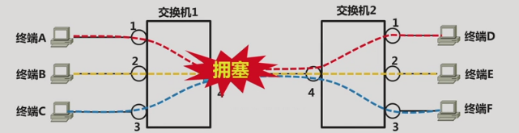
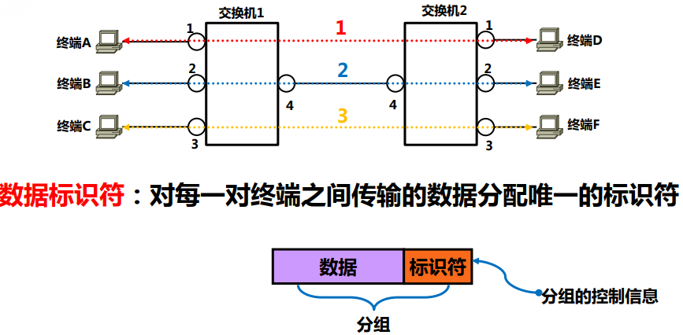
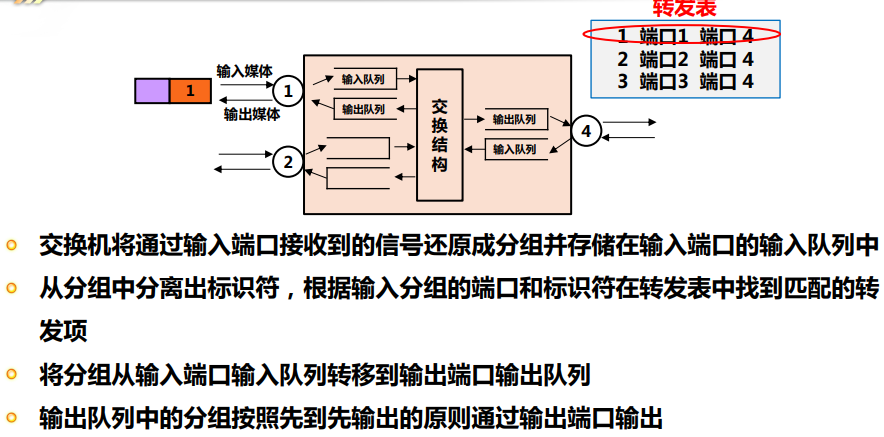
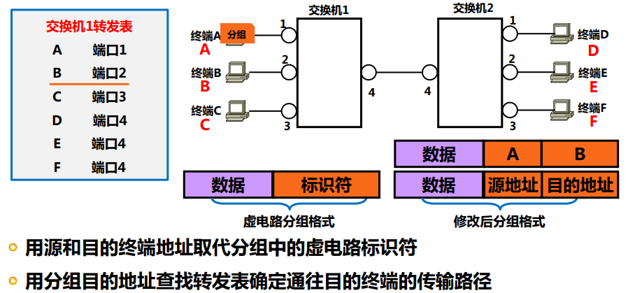
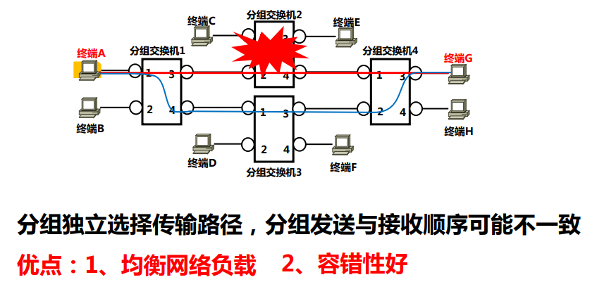
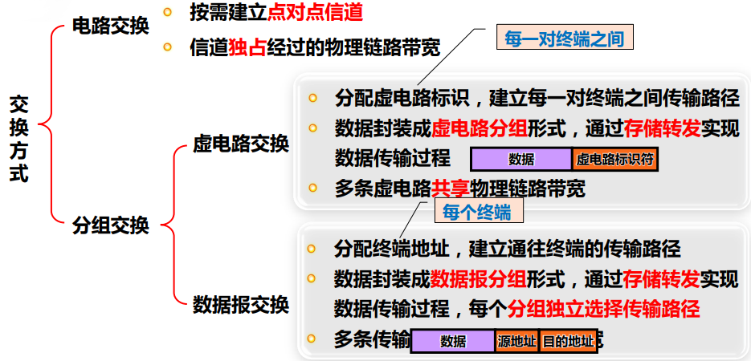
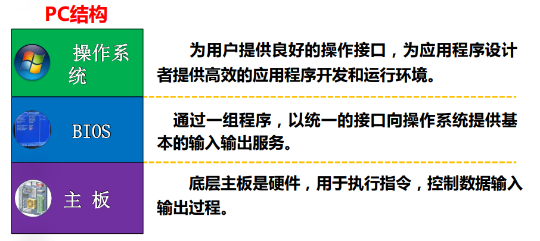

## 网络的定义
比尔盖茨在九十年代就提出: 网络才是计算机. 网络的在本质上实现了资源的共享, 包括软硬件和数据. 在不久之后的将来, 网络应该是一个互相协作的有机整体. 每台主机都是整体中的一个细胞, 再也不是什么独立的个人计算机, 包括时下大热的分布式运算和大数据恰恰是在这个方向上迈出的一个步伐. 甚至, 随着带有反省机制的元编程和神经网络的发展, 这些网络节点终有一天会具有自我总结的能力, 定期地交换数据, 甚至自发地去做这些工作. `the whole world is a Super Computer, thinks like human`
扯远了, 至少到今天, 网络的每个节点都是一个自治系统

## 互联网发展历史

ARPANET > Internet
低俗网络 > 高速网络
数据网络 > 统一网络
Internet > 移动网络, 物联网, 安全性

### 发展的技术保障
- 个人电脑
- 交换机和路由技术
- Web技术
- 移动终端
- 嵌入式和硬件单元的发展(比如触摸屏的出现极大提高了网民数量)

从交互的角度看, 不管如何发展, 实现的是人与人, 人与物, 物与物三种层次上的信息交互
其中的人不是单纯的人, 是人和智能设备的结合, 物是原有物和网络终端的混合

## 交换方式
网络的目标是实现其中任意节点终端的数据通信, 实现交换要解决两个问题: 建立数据传输通路和控制数据传输的过程
### 电路交换
最简单的方式就是对N个终端两两直接建立信道, 这样终端就可以随时并且可以同时和其他终端通信, 不现实之处在于建立这样的双向信道需要n*(n-1)个信道, 而且与其他所有终端通信的概率几乎没有.
实际使用的方案是终端与交换机相连, 并且按需建立信道(信道不固定)

特点:
- 速率稳定, 适合传输语音信号
- 在通信前后需要建立/断开连接
- 不需要考虑信息传输的机制

典型的例子就是PSTN电话网络

缺点:
- 无法共用信道, 物理链路的利用率低
- 所经过的网络必须速率一致
- 只能两两通信

### 虚电路交换
目标在于弥补电路交换无法共享物理链路的缺点

需要解决:
- 如何转发(区分不同目的地)
- 平滑流量(交换机能适配突发网络流量)

传输的数据本身带有标识符, 而在交换机内部建立转发表, 转发表维护标识符和传输路径的对应关系. 这样一来, 交换机每接收到一个数据分组就拿其中的标识符来在转发表里查看对应的具体的路径

所以, 标识符+转发表实现了交换机精确转发数据的任务
那我们再考虑一个问题, 如果同时来自不同终端的多个分组到达交换机, 如何确定转发的次序呢?
很简单, 存储转发, 维护一个队列作为缓冲区, 就好比本地进程中的缓冲区机制

### 数据报交换
再来看刚才的虚电路交换, 建立虚电路有两种方式, 动态建立或事先建立. 前者因为建立和释放电路会使得传输时延增加, 后者在转发项数目很大的时候会需要更多的存储空间和处理时间. 而且无法适应不同类型的网络环境(如果是终端间通信连接的数量可能很大, 而且连接的终端对事先不确定, 包括通信时长和通信的数据量), 而且如果事先建好所有转发表项, 很可能大部分表项实际使用频率很低. 对此更好的解决办法应该是, 转发表仅维护常用的表项, 以减少处理时间.
**虚电路交换不适合面向终端间通信的网络**
而数据报就是在虚电路的基础上进一步做了改进

- 改虚电路标识符为每个目的终端地址而不是终端对
- 改终端对的传输路径为指向终端的路径
之前是(Xi, Yi), 现在仅保留Yi, 只关注从哪个出口出去

具体改进:

- 为终端分配地址, 修改分组格式
- 转发表的每一项给出通往某终端的出口
- 以分组中的`目的地址` 来查表, 进而确定分组转发的端口

这种方式基本就是TCP/IP网络中的传送方式

数据报交换还有一个特点就是每个分组实际走的路线不唯一, 要看如何维护转发表

**数据报交换方式适合面向终端通信的网络**

### 三种实现的比较

从电路交换到分组交换: 链路的共享性, 数据的容错性, 适应网络本身间歇性, 突发性的特点

## 网络体系结构和协议
具体不赘述了, 截两张图, 有借鉴意义

- 屏蔽底层差异
- 逐层透明实现
- 专注当下, 虽小但精
- 充分借用已有的服务
