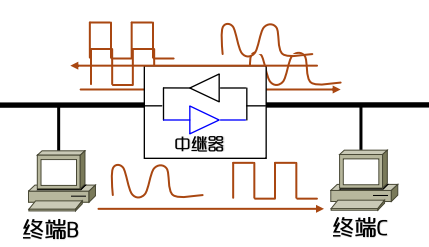

互联网是多种网络类型互联而成的网际网, 其中以太网则是应用最为广泛的局域网技术. 当年的支持以太理理论的物理学家认为以太通过电磁波充满了整个四维时空, 而这一点契合了发明者期望有一天网络能连接全部站点的愿景.

以太网本身最大的缺陷在于广播传播, 后来的VLAN技术很好地弥补了这一点

以太网发展可分为总线形和交换式两个大阶段

## 总线形以太网
### 拓扑结构
早期以太网设计时就是通过总线连接各种终端

任何一个终端向总线发送数据时, 信号会沿着总线向两端传输, 并在总段两端接上匹配阻抗来防止反射信号. 所以以太网对布线要求是很简单的, 一个T型接头就能把一个终端连到总线上

那我们想, 这条总线可以无线长吗? 事实上以太网上的信号在传输时会衰减甚至失真, 这时就需要中继器来再生信号. 所以只要不断增加中继器，总线的长度是无限的

以太网络的布置就是这样了, 接下来要处理的是有了基础网络, 如何收发数据. 要想在传输过程中对这些数据加以控制, 就会相应地添加额外的辅助信息, 而以太网中这样的一个基本数据单元就是以太网`帧`

在收发数据之前, 要先把这些二进制数据转换成信号, 也就是数据通信部分说的调制解调(模拟信号), 编码解码(数字信号)的过程.

总线形以太网是半双工通信的网络, 也就是说任何时刻只能有一个终端向总线发送数据(而这些数据是大家都可见的). 所以要实现在以太网上发送数据, 就要考虑检测总线的空闲/忙碌状态, 以及总线空闲时多个终端的竞争机制. 那么能够发送数据后, 还要考虑由谁接收, 如何解释一个完整的帧

所以一个完整的以太网还要完成的功能有:

- 数据与信号的转换
- 检测总线状态
- 公平竞争总线
- 数据封装成帧
- 帧对界
- 寻址

假如你是工程师, 面对这么多的功能需求应该要学会分层设计, 在不同层完成不同的功能

> 基带传输与曼彻斯特编码
通过时钟周期控制码元长度
曼彻斯特编码: 利用跳变实现位同步

### 数据帧封装格式

### CSMA/CD算法
前面说了当总线空闲  而有多个终端试图发送数据的话, 就得做到公平竞争总线.
CSMA/CD算法的全称叫载波侦听, 多点接入, 和冲突检测(Carrie Sense Multiple Access with Collision Detection)

工作步骤:

- 先听再讲, 侦听总线上是否有载波, 总线无载波才能发送数据, 否则继续侦听
- 等待帧间最小间隔
    * 避免一个终端连续发送多个MAC帧
    * 留出时间给接收终端以缓冲
    * 让终端正确检测先导码和帧开始分界符
- 边听边讲, 如果发生冲突则发送阻塞信号并后退等待, 否则继续发送
- 退后再讲, 后退算法要满足
    * 每个终端生成的延迟时间都是随机的, 且相互独立
    * 最小的延迟时间有且只有一个为0
    * 所有终端的平均延迟时间尽可能小

后退算法:
1. 用K记录冲突次数, 每发生一次冲突则K自增1, 但最大为10, 即K=min(冲突次数, 10)
2. 在range(2^k -1) 中随机选择整数r
3. 计算后退时间T=t*r, 其中t为协议规定的与传输速率相关的一个基本时间
4. 如果连续重传16次都检测到冲突, 则终止传输并向高层报告

网络负载越重，可能后退的时间越长
- 只适应轻负荷, 高负荷可能不断因为相同的延迟时间而不断发生冲突
- 存在捕获效应, 一个终端始终抢占到总线, 另一个终端不断提高K
- 最短帧长度和冲突域直径有制约关系

### 网桥与冲突域分割

对于CSMA/CD中的缺陷, 解决思路就是减少终端数量和缩小冲突域直径. 网桥的工作原理就是把整个以太网分割成小的冲突域, 然后将其连接起来. 网桥的基本功能是隔断电信号, 隔离不同的冲突域, 并负责转发MAC帧. 也就是当MAC帧同属一个冲突域则丢弃, 否则转发MAC帧

网桥内部维护一张转发表, 映射了终端MAC地址和转发端口. 对每一个接收到的MAC帧, 如果转发表中没有相应MAC地址的记录, 则从其他所有端口广播出去, 若存在记录则查看转发表中对应的端口, 如果发送和接受端同属一个转发端口则丢弃, 否则转发. 对于未知的记录自动学习

网桥的出现使得以太网能够真正意义上的无限扩大

## 交换式以太网和VLAN
之前讨论的以太网在实际工作中常常会广播MAC帧, 这既浪费了很多带宽资源, 也难免引起安全问题. 所以我们希望动态地缩小广播域, 并且划分的域和物理位置无关, 这就是虚拟局域网技术

交换机内部的映射表有三个字段: VLAN, 接入端口, 共享端口
