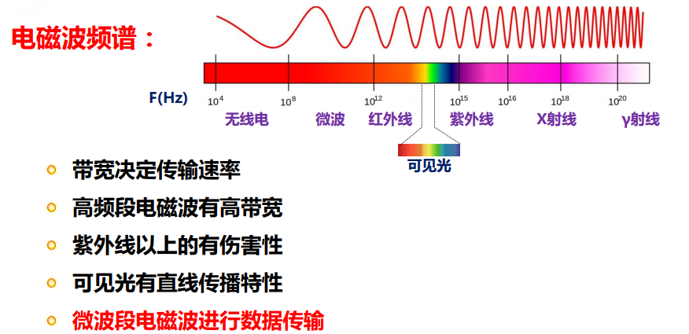
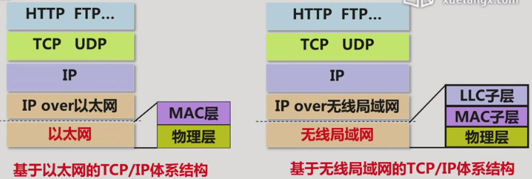
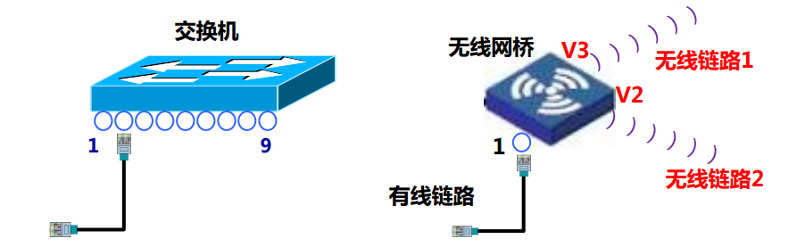
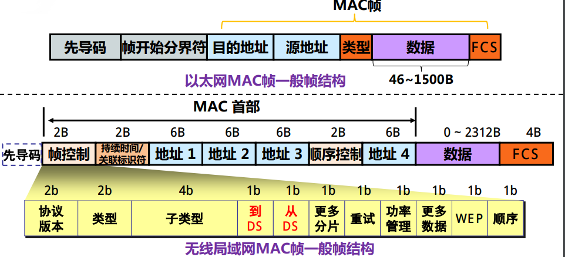
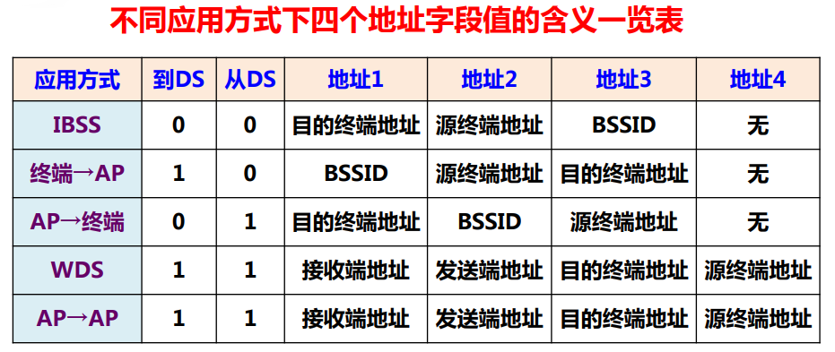
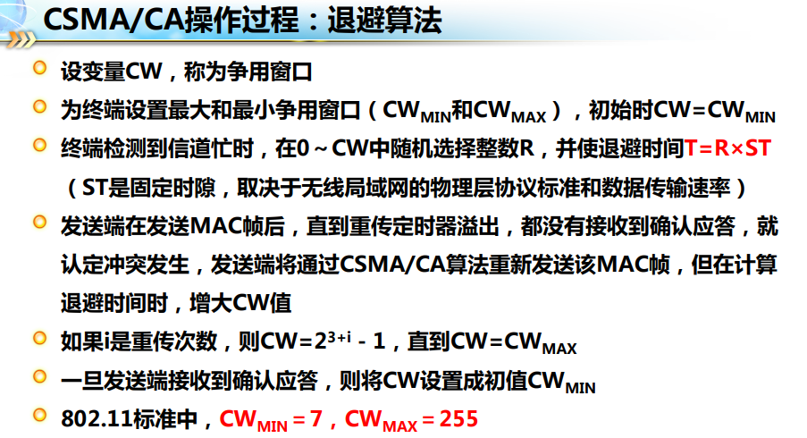
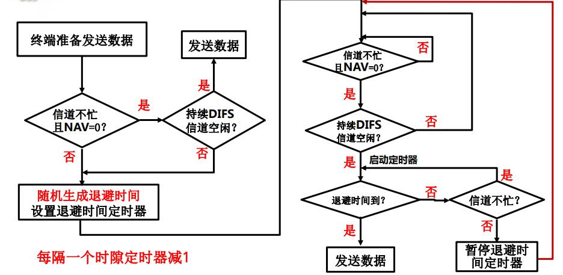

各个无线局域网之间, 通常是通过接入点AP来连接到一个以太网, 通过以太网来达到网际互连

## 概述
无线传输的本质: 电磁波传输, 由变化的电场激发出变化的磁场, 再由变化的磁场激发出变化的电场. 而计算机中的二进制位要先调制成模拟信号才能转换成电磁波

- 数据传输的速率和电磁波的波特率成正比, 而电磁波的波特率和电磁波的带宽成正比
- 能量损耗和传播距离的平方成正比
- 容易互相干扰
- 多径效应
- 隐蔽站问题, 同时给一个终端发送数据导致冲突
- 暴露站问题
- 信号无法再生

## 体系结构

- 逻辑链路控制子层(LLC): 指定数据类型
- MAC子层: MAC地址, MAC帧封装, 争用无线信道
- 物理层: 无线信道二进制位流传输功能

## 组网方式

### 独立基本服务集(IBSS)
基本服务集是无线局域网中最小的构成单元, 一个只包含工作站的基本服务集成为独立基本服务集, 而含有AP(无线访问接入点)的则称为基本服务集(BSS), 其覆盖的地理范围成为基本服务区(BSA)

- 网络结构: 由一台终端创建, 加上服务区内其他的终端(比如电脑打开WI-FI共享)
- MAC帧传输: 逐段确认, 与以太网不同, 每一个终端接收到数据后要发送相应的应答帧

### 基本服务集(BSS)
AP的接入使得一个IBSS可以和其他网络互连, 它还负责区分源和目的终端是否在同一个BSS中
AP在转发之前同样要向来源终端发送应答帧, BSS内存在信道争用, 所以能服务的终端有限

### 扩展服务集(EBSS)
通过AP将BSS与其他网络相连的网络, 注意无线网和以太网中的MAC帧格式不同(数据类型字段), 因此AP实际上还承担了两种帧格式的转换任务, 而对于以太网来说, 连入其中的一个BSS就是一个网段

有的时候因为不方便架设物理线路, 需要直接把BSS相连, 这时候就需要无线网桥.
无线网桥就类似以太网中的交换机

## 无线MAC帧格式

- 无线局域网的MAC帧可以分控制, 管理和数据三种类型, 每种类型的MAC帧使用图中的几种字段(并不是全部字段会同时出现在一个MAC帧里面)
- 四个地址字段是为了满足逐段确认的要求
- 到/从DS: 向AP发送/由AP发送时置位
- 持续时间用于预留无线信道
- 顺序控制用于解决接收端MAC帧重复接收的问题

现在我们考虑最简单的没有AP和其他网络的独立基本服务集, 这样一个基本服务集有一个BSSID, 基本服务集标识符(basic service set IDentification), 它是在创建IBSS时生成的48位随机数, 用于唯一标识该IBSS
那么此时MAC帧的字段

- 地址1: 目的终端的MAC地址
- 地址2: 源终端的MAC地址
- 地址3: BSSID
- 地址4: 无
- DS: 由于没有AP, 所以两个DS都是0

然后是有AP或网桥存在的基本服务集BSS, 注意在BSS中, 任何两个终端间的通信都要经过AP来转发, 且AP的地址就是BSSID

如果是终端向AP发送
- 地址1: AP的MAC地址
- 地址2: 源终端的MAC地址
- 地址3: 目的终端的地址
- 地址4: 无
- DS: 1/0(向AP发送)

如果是AP向终端转发

- 地址1: 目的终端的MAC地址
- 地址2: AP的MAC地址
- 地址3: 源终端的地址
- 地址4: 无
- DS: 0/1(由AP发送)

最特殊的是WDS, 两个由无线网桥相连的BSS的网络结构中, 当MAC帧在中间这两个无线网桥中传递时

- 地址1: 目的无线网桥的MAC地址
- 地址2: 源网桥的MAC地址
- 地址3: 目的终端的地址
- 地址4: 源终端的地址
- DS: 1/1

AP-repeat, 网络中间由两个AP来通信

- 地址1: 目的AP的MAC地址
- 地址2: 源AP网桥的MAC地址
- 地址3: 目的终端的地址
- 地址4: 源终端的地址
- DS: 1/1

`地址1和地址2始终描述单次传输中的目的和源, 而地址3和地址4作为多段传输的辅助地址`
所以不难发现, DS的四种模式分别代表了四种网络结构中的MAC帧格式

## DCF和CSMA/CA
和总线型以太网中的总线竞争类似, 无线网络中会面临`多点接入` 带来的一些问题, 相应地就出现了分布协调功能(DCF)和CSMA/CA算法, 以及用  RTS和CTS解决隐蔽站的问题

对多点接入的控制是无线局域网MAC层提供的功能, 有一下两种方式:
- 分布协调功能(DCF): 终端自由平等竞争无线信道 (IBSS, BSS, 必选)
- 点协调功能(PCF): 依靠AP询问以分配信道 (BSS, 可选)

### DCF
分布协调的目标在于建立终端自由平等竞争无线信道的机制, 实际上和以太网中的CSMA/DC算法类似, 不过无线网中的策略是CSMA/CA, 冲突避免而不是冲突检测

CSMA/CA操作有以下过程
信道空闲的条件:
- 信道不忙
- 网络分配向量NAV为0, 它与MAC帧中字段"持续时间"有关

在检测到信道空闲时并不是马上就可以发送数据, 这时终端还要等待一个帧间间隔

帧间间隔的长度根据MAC帧的类型而定(控制, 管理, 数据), 帧间间隔的长度也决定了MAC帧发送的优先级, 帧间隔越短, 对应的优先级越高

帧间间隔的作用: 帧对界, 让连续接收MAC帧的接收端得以清空缓存, 天线发送/接收状态的转换

帧间间隔的类型:
- 短帧间间隔(SIFS): 无线局域网要求的最短帧间间隔, 在这段时间里终端完成发送/接收的转换, 它对应的MAC帧此时已经获取信道的控制权
- 分布协调功能帧间间隔(DIFS): 其时间长度 = SIFS + 2个时隙

当检测到信道空闲, 并且等待了相应的帧间间隔后, 数据仍然不能直接发送, 这时候还有退避机制:

> 当初始检测到信道忙, 每个终端通过退避算法产生独立的随机延迟时间, 而当信道持续空闲DIFS之后, 要继续空闲退避时间才能发送数据

如果两个终端同时检测, 也同时产生了一样的退避时间呢?

退避算法:
- CW是指数增长的, 且按照802.11标准不难看出第五次重传时达到最大争用窗口

