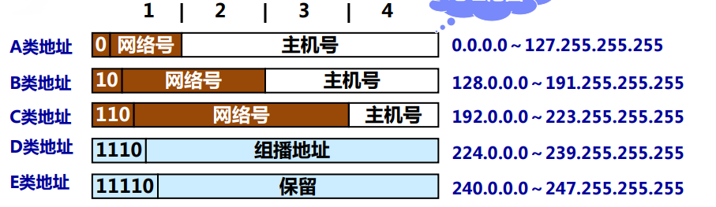
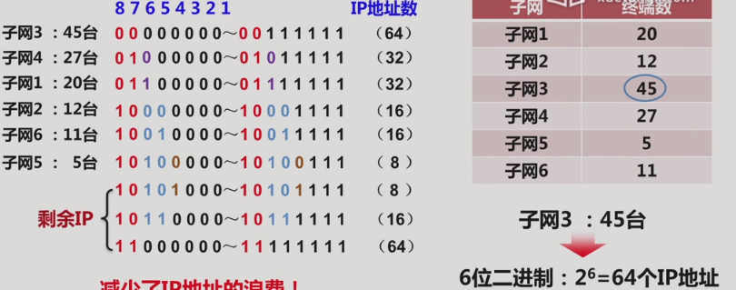
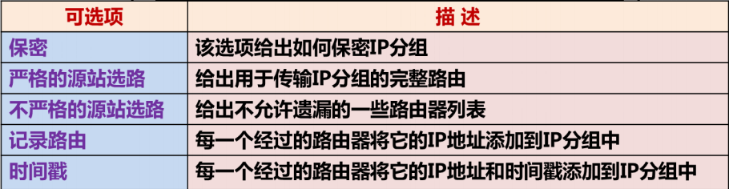
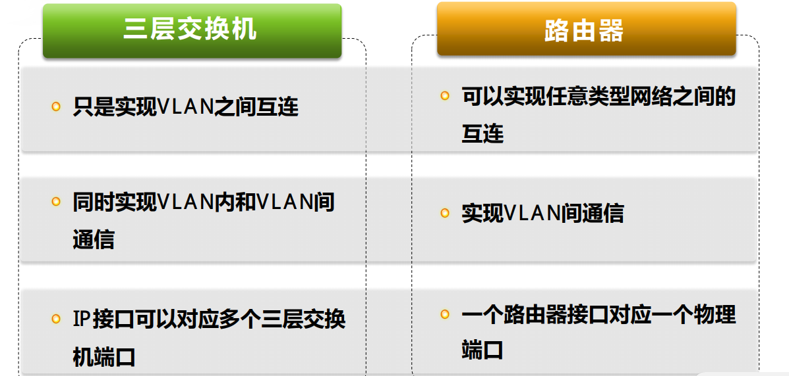

## 网络互连机制
信件投递过程的启示: 假设你在南京要向美国硅谷的好朋友的笔友寄信, 显然从南京到硅谷没有直接相连的运输通道, 寄信过程需要经过若干站点的中转, 比如说先通过国内的铁路运输系统把信件送往上海, 再在上海通过航空运输把信件带到美国. 在这个过程中有以下几点需要注意:

- 不同的运输系统有着不同的信件封装格式(协议不同): 邮局将零散的信件整理成信袋交给铁路部门, 而同样地信件要整理成航空邮包才能空运
- 信件上的收信人和寄信人的地址是不变的, 这和中转所涉及的运输系统标识的始站和终站无关
- 信件本身是周知的封装格式, 与运输系统的封装格式(信袋, 邮包, 包裹)无关
- 信件投递的路径是逐级确认的, 由每一中转根据收信人地址来确定下一站的地址, 并不是一开始就确定好了全部路线
- 信件本身是始终不变的

通过IP实现的网络互连机制也是类似的

- 统一编址: IP地址独立于传输网络, 且全网统一
- 统一封装: IP分组独立于传输网络, 通过IP地址表示发送端和接收端
- 逐跳转发: 每一跳根据IP分组上的目的地址来确定下一跳, 每一跳只负责传递分组, IP分组在传输过程中始终不变
- 在不同的网络中传输时, 要把IP分组封装成相应网络的帧格式

## 网际协议

### IP的编址
IP编址有分类和无分类编址两种, 当前的网际协议IP有IPv4和IPv6两个版本, 前者是一个32位的二进制数(四字节), 后者是128位的二进制数(十六字节). 128Bit是个什么概念呢? 就是说这种编址范围可以满足给地球上每一粒沙子都能得到一个IP地址, 但目前还只在一些高校和实验性网络中使用, 以下主要讨论IPv4

在实际中, 32位的IP地址中一部分表示网络号, 剩下的则表示主机号. 在分类编址中, 根据网络号占用的不同长度的字节来划分编址的类别, 而在无分类编址中,

### 分类编址
单播地址有网络号和主机号之分, 而D类地址只有网络号.
主机号全0表示当前主机的网络地址, 而全1则代表该网络的广播地址, 而32位全1表示受限广播地址(仅限发送终端所在网络)
其他一些特殊的地址:

-   0.0.0.0, 表示IP地址无法确定, 通常用在主机本身还未分配IP地址时作为其IP分组的源地址
- 127.x.x.x, 回环测试地址
- 224.0.0.1, 组播地址, 表示网络中所有支持组播的终端和路由器
- 224.0.0.2, 组播地址, 表示网络中素有支持组播的路由器
- 224.0.0.9, 组播地址, 表示网络中所有运行RIP进程的路由器

现在看到这套规则就联想到UTF-8的编码规则, 有异曲同工之妙

IP地址分类? 适应不同的网络规模
IP地址分层? 可以根据终端IP地址来确定终端所连接的网络类型, 使用网络地址来减少路由项

一个易犯的认知误区: IP地址并不是确定一台主机或路由, 而是这些终端上的每一个接口

IP地址分类的缺陷:

- IP地址浪费严重: 每一类地址的主机数都有明确数量, 较难适配实际需求
- 不能有效减少路由项(不能合并非'整'字节的地址)
- C类地址使用率低(网络号数量很大, 但主机数过少, 使得很多时候都申请了B类地址, 而拿到某B类地址的网络号, 其主机地址通常又过剩)

### 无分类编址
很多事物的发展, 都是伴随在不断的发现问题和解决问题的过程之中的, 就好像高中哲学里说的, 事物发展的前进性和曲折性相统一的原理. .

此前已经发现, 虽然IP地址分类分层的想法本来是想提高IP地址的利用, 但实际应用却差强人意, 其根结就在于设计之处把网络号与主机号的位数给定死了.

所以无分类编址就是允许自定义网络/主机号位数的编址方式, 这时就引入了一个辅助手段: 子网掩码. 无分类编址 通过子网掩码来指明IP地址中网络号的位数, 由此产生了CIDR(Classless Inter-Domain Routing) 无类别域间路由.

<网络前缀, 主机号>

同样的, 主机号全0视为网络地址, 而全1则为该网络的广播地址, 若网络前缀全0的IP地址视为主机地址

CIDR地址块的优点:

- 方便聚合路由项
- 网络地址的分配更加自由

注意: 分配子网时从主机需求量按递减次序来分配, 不难发现这种分配机制基本上是需要多少就分配多少

### IP分组格式
IP协议的主要内容其实就两点, 一是独立于确定网络的编址方式, 二是规定独立于任何传输系统的分组封装格式

#### IP分组首部格式
IP首部分为20字节的固定部分和可变部分

- 版本: 4位, 0x0100或0x0110
- 首部长度: 4位, 字段所代表的单位是32位即4字节, 最小值为5即20个字节. 通过该字段可以确定在一段IP数据流中包括可选字段在内的首部大小
- 服务类型: 8位, 指定IP的优先级, 延迟, 吞吐量和可靠性等要求
- 总长度: 16位, 指明IP首部和IP数据部分的长度, 最大值为65535字节
- 标识, 标志, 片偏移: 用于IP分片.
    * 标识: 用于确定分片的归属
    * 标志: 含有DF, MF和一个保留位. DF=1不允许分片, MF=0表示当前为的最后一个分片
    * 片偏移: 给出当前数据片在原IP分组中的位置
- 生存时间: 限制IP分组在网络中存在时间的计数器, 通常作为最大跳数来使用
- 协议: 告知网络层如何处理IP分组(转交给哪一进程)
- 首部检验和: 每经过一跳都要重新计算一次

出于安全考虑, 有时候路由器会关闭这些可选字段

链路层实际可以传输的最大单元数据大小称为MTU(最大传送单元)
每个IP分片的数据长度L(Bit)应满足: L+ 20 < 1500 且L可以被8整除(整字节)

### 小结
-  IP分组的固定部分包含保证IP分组端到端正确传输所需的控制信息
-  可选字段具有很强的网络拓扑结构侦查能力, 通常会被路由器所屏蔽

## IP的传输
- 首先要建立IP传输路径
- IP分组逐跳转发
    * 默认网关确定第一跳IP地址
    * 路由表和目的终端IP地址确定下一跳IP地址
- 通过IP Over X技术和X网络实现具体的传输过程

## 路由表的建立
不难发现在上面IP分组传输过程中, 关键点在于建立路由项然后整个网络就能很"聪明"地开始工作了
路由器中的路由项可以分为以下三类:

- 直连路由项: 完成路由接口IP地址和子网掩码配置后由路由器自动生成
- 静态路由项: 手工配置
- 动态路由项: 通过一些路由协议来动态生成

这里主要还是靠RIP协议来动态生成路由项的

## 互连设备间的区别

### 二层交换机和路由器
- 二层交换机: 最高层为MAC层, 处理的是MAC帧, 实现不同物理层的多段网络互连
- 路由器: 最高层为IP层, 处理的是IP分组, 实现多个不同类型网络的互连

### AP和路由器
AP实现了无线局域网和以太网的互连, 并且本身是透明的:

- 无线局域网和以太网分配相同的网络地址
- 当无线局域网中的终端和以太网中的终端通信时, 二者MAC帧中的MAC地址是相同的
- AP直接负责两种MAC格式的转换

### 三层交换机和路由器

