## 传输层的服务特性
对于传输层, 就是很常见的TCP, UDP协议. 在开始协议内容之前, 要先有两点认识

传输层提供两种类型的服务, 一种面向字节流服务, 一种面向报文服务

- 面向字节流服务
    * 视传输数据为无结构的字节流
    * 传输层可以对数据作任意分段
    * 没有数据长度的限制(无非作更多的分段)
- 面向报文服务
    * 应用层提供报文
    * 传输层不负责报文的分割和拼装工作
    * 报文长度受限制(因为不能自由切分, 所以间接受MTU限制)

两者相比, 字节流服务对应用层的负担小, 应用层要传输的东西直接扔给下层接收端就能按序地得到相应的数据流; 而面向报文的服务则需要应用层做更多的工作

而传输层的连接, 也有两种

- 面向连接的服务
    * 开始传输前有个协调过程, 比如: 确定双方就绪, 双方分配资源(缓冲区等), 协商一些参数
    * 提供端到端的按序, 可靠的传输服务
- 面向无连接的服务
    * 与前者相反, 没有协调过程, 传输服务不按序也不可靠

基于上述区别, 实际的协议实现就有TCP和UDP两种

传输层和此前的交换网络(电路交换和虚电路交换)的区别在于前者仅仅是两个终端的参数预设和资源预留, 而后者的本质是建立终端之间的一条完整的传输路径

## 端口号
我们知道网际层中的IP地址可以在全球唯一地标识一台主机, 但在网络传输过程中, 实际进行通信的对面并不是这两台主机, 而是运行在其中的两个进程, 也就是说, 我们需要一定的机制来对运行在一台主机中的进程加以区别. 这样就引入了端口机制, 不过它倒不是不是为每一个进程一一分配端口, 而是根据进程所提供的不同服务对于不同的端

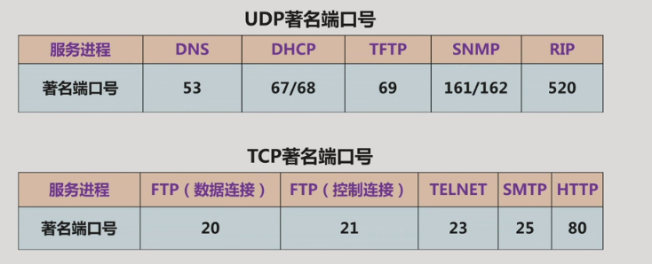

端口号的分配由互联网数字分配机构IANA负责, 一个端口号是16位的二进制数, 划分有著名端口号[0, 2 ** 10), 注册端口号[2 ** 10, 2 ** 14 + 2 ** 15)和临时端口号[2 ** 14 + 2 ** 15, 2 ** 16)三种

(然而学校里说的只有熟知和临时两种)

## 协议的三要素
语法, 语义, 时序

## UDP 用户数据报协议

### 服务特性和功能
- 特性:
    * 面向报文
    * 面向无连接
- 功能:
    * 差错检验
    * 标识不同进程

### 协议分析

- 标识进程: 源端口和目的端口字段, 两个16位
- 差错检验: 检验和字段, 包括数据段在内的UDP报文的检错(出错就丢弃报文)
- 报文长度: 长度字段

在IP分组基础上解决了进程标识和差错检验问题, 但没有重传机制和拥塞控制

### 用途举例
- 当数据的实时性要求高于可靠性, 传输中的部分误差不影响服务本身, 如语音服务
- 简短交互应用, 一次性的简短报文服务, 不需要在建立连接上耗时

## TCP 传输控制协议
### 服务特性和功能
- 特性:
    * 面向字节流
    * 面向连接
- 功能:
    * 进程标识
    * 差错控制
    * 拥塞控制

###协议分析
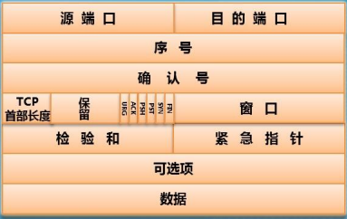

- 标识进程: 源/目的端口字段(各16位)
- 字节流拆分组装: 序号字段, 给出当前报文数据段首字节在源数据字节流的相对位置(4字节)
- 差错控制: 检验和字段(2字节)
    * 确认序号字段(4字节), 期望下一个接收的数据相对字节号, 所有小于确认字段的报文都已经正确接收
    * 确认位ACK, 置真时确认序号才生效
- 流量控制: 窗口字段, 发送端所允许的传输数据的字节上限，发送端实际传输的数据字节数还受网络状态制约
- 连接的建立和释放: 同步位SYN, 终止位FIN, 复位位RST
- 首部长度和保留位(6位)
- 其他控制字段: 紧急位URG, 紧急指针(16位), 推送位PSH, 以及其他的可选项(最多40字节)

### 连接的建立与释放
TCP是基于C/S模型的网络协议, 当客户端发起连接请求时, SYN=1, ACK=0, 序号=X, 服务器若响应连接, SYN=1, ACK=X+1, 序号=Y(起始序号), 窗口=WS(服务器开辟的缓冲区大小), 当客户端接收到连接响应后, SYN=0, ACK=1, 窗口=WC, 确认序号=Y+1

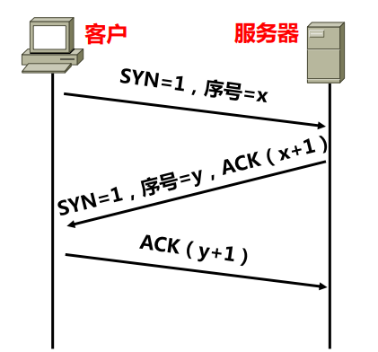

完成数据传输后, 客户端发送一个连接释放请求, FIN=1, ACK=1, 序号=U(已发送的最后一个字节序号+1), 服务器接收到连接释放请求, 释放为连接所分配的资源, 同时ACK=U+1, FIN=0. 服务器完成数据传输, 也向客户端发出连接释放请求, FIN=1, ACK=U+1, 序号=V(同样是已发送的最后一个字节序号+1), 客户端返回确认应答, 也释放响应的资源, ACK=V+1, FIN=0, 服务器接收到此确认应答释放所有资源, 关闭整个连接

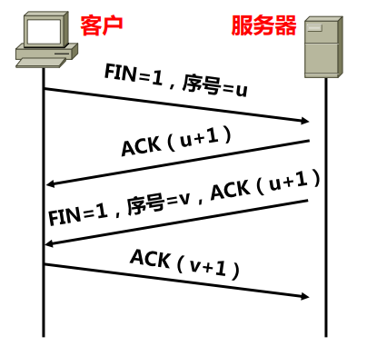

### 发送窗口和接收窗口

### 差错控制机制
要想提供按序可靠的服务, 离不开完善的差错控制

端到端传输的出错原因

- 端到端存在的多条传输路径导致报文经过网络传输后可能错序
- 物理链路的出错导致报文被丢弃
- 接收端可能重复接收报文
- 报文在传输过程中出错, 接收端检验和检测出错然后丢弃
- 分组交换设备因为拥塞导致输出队列溢出因为丢弃报文(主要)

可分为两类: 接收端成功接收但数据有误(数据出错, 顺序出错, 重复接收),  或者是传输过程中被丢弃.
所以相对应的差错控制机制就有: 检错, 确认应答和重传

接收端要对将要发送的数据进行数据分段, 要综合考虑到重传效率, 接收端缓冲区大小, 不超过IP分组的最大长度, 尽量避免IP分组被分片

#### 确认应答
- 逐个确认
- 累积确认
- 重复确认(传输时延引起错序, 丢失引起的错序)

#### 重传条件
- 发送端设置的重传定时器溢出
- 收到连续4个确认序号相同的确认应答

偶尔丢失报文
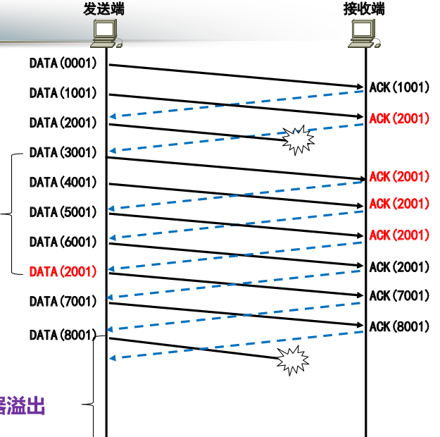

大量丢失报文
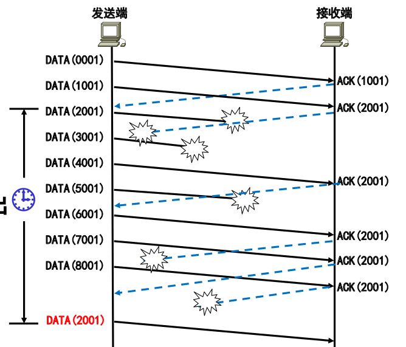

小结:
- 按序到达的数据调整确认序号,未按序到达的数据维持确认序号不变
- 发送端重传数据的条件: 重传定时器溢出, 连续接收4个确认序号相同的确认应答

### 拥塞控制机制
拥塞原因:

- 拥塞主要和网络流量的分布状态有关
- 提高转发结点的性能并不能消除拥塞

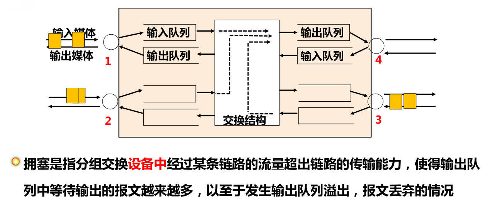

解决拥塞的简单办法是控制发送端流量, 发送窗口=MIN[拥塞窗口CWND, 接收端公告的窗口字段值]

调整过程
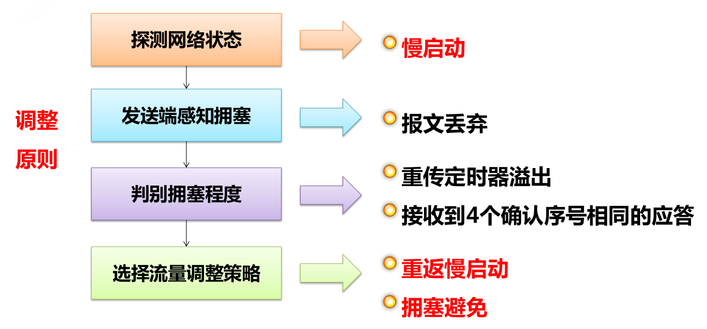

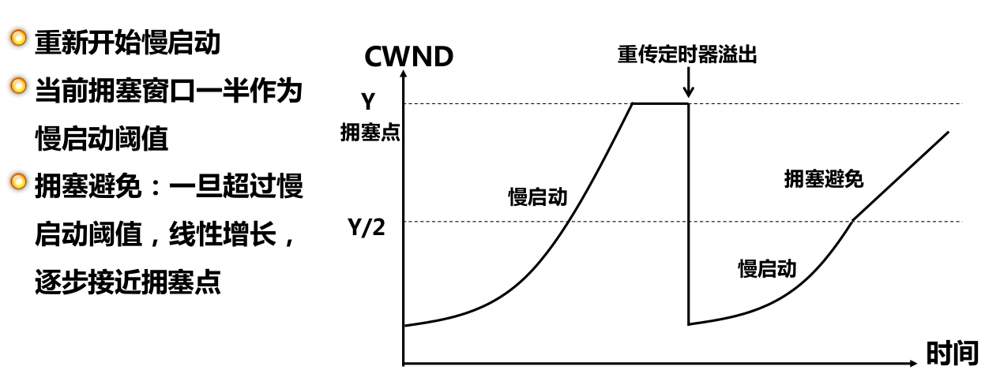

- 流量降到拥塞窗口一半
- 改为线性增长

### 几点说明

- TCP与IP的分工
- TCP差错控制与传输网络提供的差错控制

#### TCP与IP分工

传输IP分组时没有建立虚电路, 并且路由器独立路由每个IP分组使得不能通过差错控制机制实现可靠传输, 不能保证IP分组的按需到达

为减轻核心路由器的工作负担, 简化了路由转发的过程(省去费时的数据检错, 只对IP首部检错)

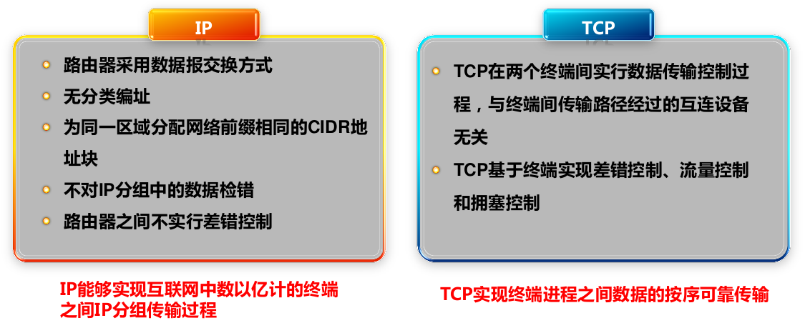

就是尽可能地把对数据传输的控制工作交给终端而不是传输设备

链路层使用循环冗余检验CRC来检错, 不涉及数据部分

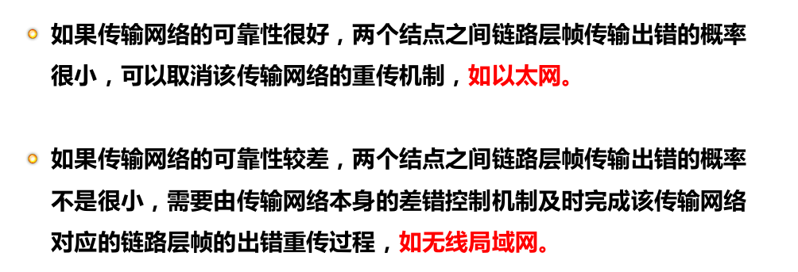
