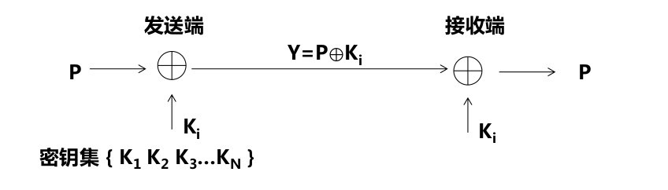

# 概述

## 网络安全的目标

- 可用性: 始终保证授权用户能用, 非授权用户不能用
- 保密性: 始终保证非授权用户无法看到网络信息
- 完整性: 始终保证网络信息不被篡改
- 不可抵赖性: 不能否认曾经完成的操作或承诺
- 可控制性: 对网络信息传播方式和内容进行控制

# 网络安全基础

## 数据加密
数据加密是将信息(明文)经过密钥及加密函数装换, 变成无意义, 可可读的密文, 而接收方可以通过解密函数和密钥来将密文还原成明文

根据加密/解密密钥是否相等有对称/不对称密钥加密之分

### 对称密钥加密
其加密/解密算法都是公开的, 重点是要保证密钥的安全性

- 分组密码: 即使知道算法过程, 但因为密文有限而无法推导出密钥, 算法复杂
- 序列密码: 每个密钥只进行一次加密运算, 切每个密钥都是从一个足够大的密钥集中随机产生, 密钥之间没有任何关联性

#### 分组密码
将明文先分割成固定长度的数据段, 然后单独对每一段数据进行加密运算, 产生和数据段长度系统的密文, 密文序列和明文的分组一一对应

常见的分组密码加密算法:
- 数据加密标准(DES)
    - 密钥长度和数据段长度均为64位
    - 加密前将明文分割成64位数据段
    - 产生64位的密文
- 高级加密标准(AES):
    - 密钥长度可以是128, 192, 256位, 数据段长度固定位128位
    - 加密前将明文分割成128位数据段
    - 产生128位的密文

安全性分析:
- 数据段长度: 增加长度有利于提高加密算法的安全性, 但增加运算复杂性
- 密钥长度  : 同上, DES的64位密钥加密算法的安全性已不能保证

#### 序列密码
也称为流密码, 一次一密钥的加密过程

序列密码的限制:
- 密钥集本身是有限的
- 密钥集中的密钥是用算法生成的, 密钥之间无法做到无关性
- 发送/接收端每次数据传输过程都必须同步密钥

## 不对称密钥加密算法
加密和解密时的密钥不同

### 公开密钥加密
- 成对生成公/私钥, 且一一对应
- 加密和解密算法公开, 而且可以对调
- 计算可行性而言, 不能根据PK导出SK
- 计算可行性而言, 不能根据PK和密文推导出明文

### RSA
git 免密码登录

# 病毒检测与防御技术

## 恶意代码定义与分类

恶意代码: 指经过存储介质和网络实现计算机系统间的传播, 未经授权破坏计算机系统完整性的一段程序

- 非授权性
- 破坏性

恶意代码分类(代码的独立性和自我复制性)

- 独立的恶意代码是指具备一个完整程序所应该具有的全部功能,能够独立传播、运行的恶意代码,这样的恶意代码不需要寄宿在另一个程序中。
- 非独立恶意代码只是一段代码,它必须嵌入某个完整的程序中,作为该程序的一个组成部分进行传播和运行

## 防御技术
1. 基于特征的扫描技术: 建立病毒特征库,通过分析已经发现的病毒,提取出每一种病毒有别于正常代码或文本的病毒特征,然后根据病毒特征库在扫描的文件中进行匹配操作。

2. 基于完整性检测的扫描技术
完整性检测是一种用于确定任意长度信息在传输和存储过程中是否改变的技术,它的基本思想是在传输或存储任意长度信息P时,添加附加信息C,C是对P进行报文摘要运算后的结果

3. 基于线索的扫描技术

4. 基于行为的检测技术

5. 基于模拟运行环境的检测技术

# 无线局域网安全
无线环境不同与以太网的首要特征就是其开放性

- 任一中断可以向无线局域网中的其他终端发送数据
- 任何在某终端的无线传播范围内的其他终端都能捕获其发送的数据

## 安全机制

- 接入控制: 防止冒充授权终端
- 加密数据: 防止他人窃取数据
- 完整检测: 防止数据被人篡改

所以**无线局域网安全技术**就是实现终端身份鉴别, 数据加密, 数据完整性检测的技术

## WEP

### WEP实现的数据加密过程

### WEP实现的身份鉴别

### WEP存在的安全缺陷

